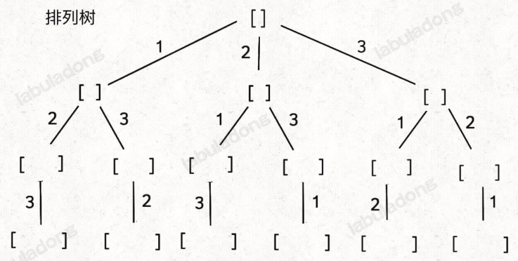
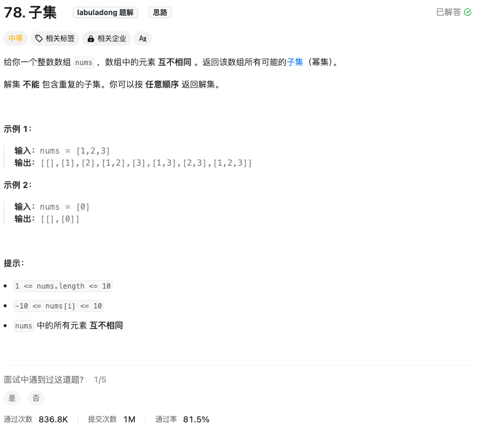
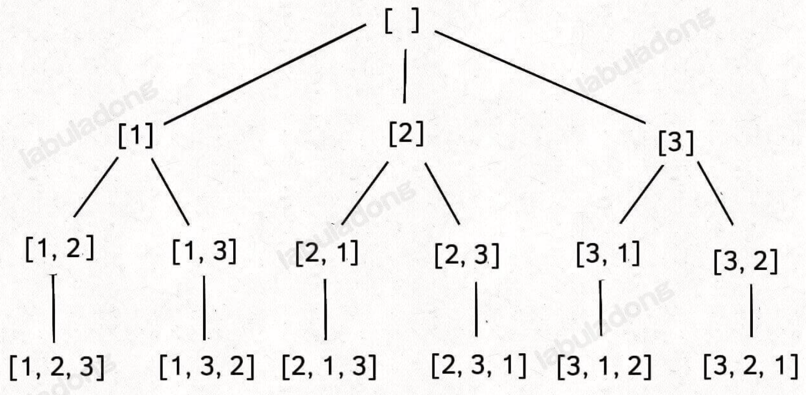
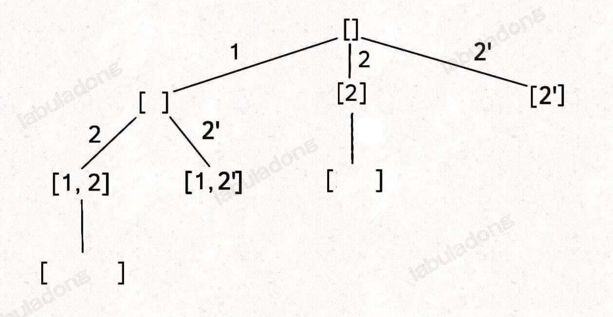
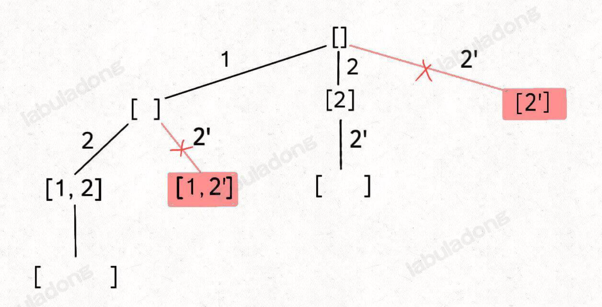
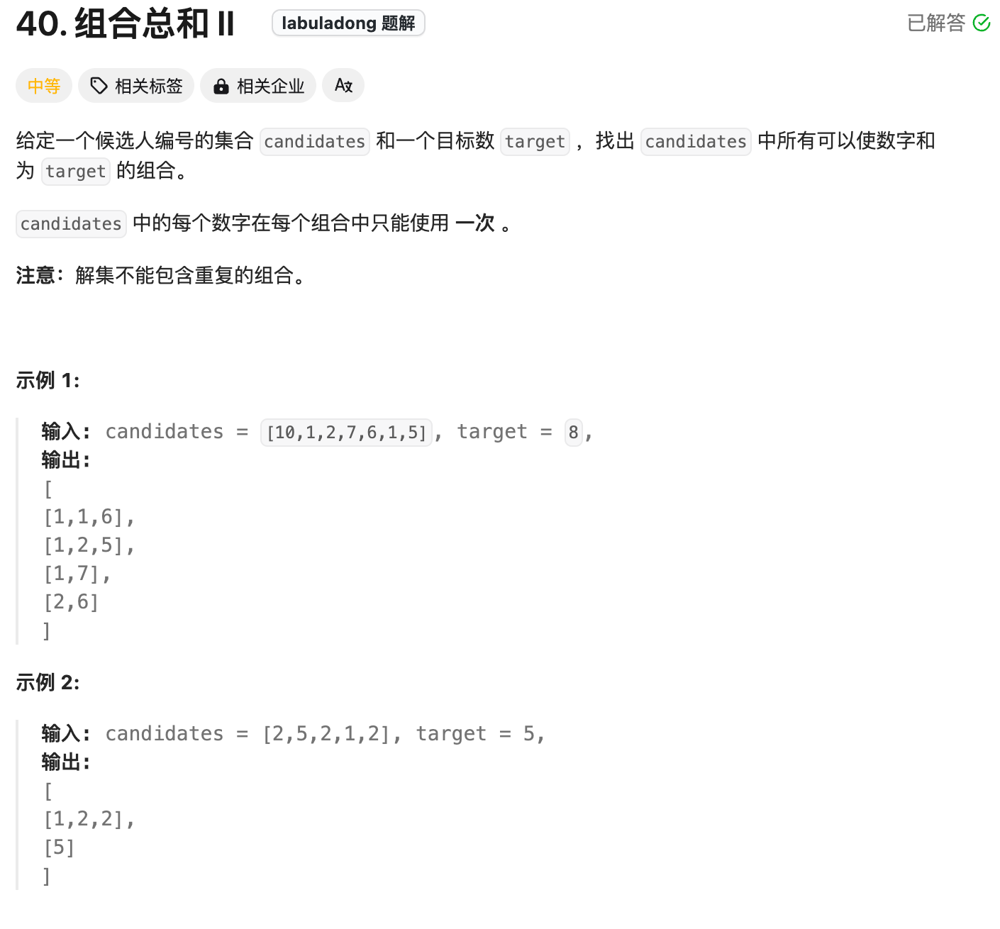

# 回溯算法

## 框架

```js
result = []
def backtrack(路径, 选择列表):
    if 满足结束条件:
        result.add(路径)
        return

    for 选择 in 选择列表:
        做选择
        backtrack(路径, 选择列表)
        撤销选择
```

> [!IMPORTANT]
>
> **抽象的说，解决一个回溯问题，时间上就是遍历一颗决策树的过程，树的每个叶子节点存放着一个合法的答案。你把整棵树遍历一遍，把叶子节点上的答案都收集起来，就能得到所有合法的答案**

- 站在回溯树上的一个节点，你只需要思考 3 个问题：

1. **路径**：也就是已经做出的选择。
2. **选择列表**：也就是你当前可以做的选择
3. **结束条件**：也就是到达决策树底层，无法再做选择的条件

虽然排列、组合、子集问题就是高中就学过，但如果想编写算法解决他们，还是非常考验计算机思维的，本文就讲讲编程解决这几个问题的核心思路，以后再有什么变体，你也能手到擒来，以不变应万变。

无论是排列、组合还是子集问题，简单说无非就是让你从序列 `nums`中已给定规则取若干元素，主要有以下几种变体：

**形式一： 元素无重复不可复选，即`nums`中的元素都是唯一的，每个元素最多只能被使用一次，这也是最基本的形式。**

- 以组合为例，如果输入`nums=[2,3,6,7]`，和为 7 的组合应该只有`[7]`

**形式二：元素可重复不可复选，即`nums`中的元素可以存在重复，每个元素最多只能被使用一次**

- 以组合为例，如果输入`nums=[2,5,2,1,2]`，和为 7 的组合应该有两种`[2,2,2,1]`和`[5,2]`

**形式三： 元素无重复可以复选，即`nums`中的元素都是唯一的，每个元素可以被使用若干次**

- 以组合为例，如果输入`nums=[2,3,6,7]`，和为 7 的组合应该有两种`[2,2,3]`和`[7]`

**但无论形式怎么变，其本质就是穷举所有解，而这些解呈现树形结构，所以合理使用回溯算法框架，稍改代码框架即可把这些问题一网打尽**

记住如下子集问题和排序问题的回溯树，就可以解决所有排列组合子集相关问题：




**首先，组合问题和自己问题其实是等价的，至于之前说的三种变化形式，无非是在这两棵树上减掉或者正价一些树枝罢了。**

### 子集（元素无重复不可复选）

力扣第 78 题「[子集](https://leetcode.cn/problems/subsets)」就是这个问题：

题目给你输入一个无重复元素的数组 `nums`，其中每个元素最多使用一次，请你返回 `nums` 的所有子集。

函数签名如下：

```
function subsets(nums) {}
```

比如输入 `nums = [1,2,3]`，算法应该返回如下子集：

```
[ [],[1],[2],[3],[1,2],[1,3],[2,3],[1,2,3] ]
```



```js
var subsets = function (nums) {
  // 用于存储结果
  const res = []
  // 用于记录回溯路径
  const track = []
  // 回溯算法核心函数，遍历子集问题的回溯树
  const backtrack = (start) => {
    // 前序遍历位置，每个节点的值都是一个子集
    res.push([...track])
    // 回溯算法标准框架
    for (let i = start; i < nums.length; i++) {
      // 做选择
      track.push(nums[i])
      // 回溯遍历下一层节点
      backtrack(i + 1)
      // 撤销选择
      track.pop()
    }
  }

  backtrack(0)
  return res
}
```

### 组合（元素无重复不可复选）

如果你能成功的生成所有无重复子集，那么你稍微改改代码就能生成所有无重复组合了，你比如说，让你在`nums=[1,2,3]`中拿 2 个元素形成所有的组合，你怎么做？

稍微想想你就会发现，大小为 2 的所有组合，不就是所有大小为 2 的子集吗

所以我说组合和自己是一样的：大小为`K`的组合就是大小为`K`的子集

比如力扣第 77 题「[组合](https://leetcode.cn/problems/combinations)」：

给定两个整数 `n` 和 `k`，返回范围 `[1, n]` 中所有可能的 `k` 个数的组合。

函数签名如下：

```
var combine = function (n, k) {}
```

比如 `combine(3, 2)` 的返回值应该是：

```
[ [1,2],[1,3],[2,3] ]
```

这是标准的组合问题，但我给你翻译一下就变成子集问题了：

**给你输入一个数组 `nums = [1,2..,n]` 和一个正整数 `k`，请你生成所有大小为 `k` 的子集**。

还是以 `nums = [1,2,3]` 为例，刚才让你求所有子集，就是把所有节点的值都收集起来；**现在你只需要把第 2 层（根节点视为第 0 层）的节点收集起来，就是大小为 2 的所有组合**：


```js
var combine = function (n, k) {
  const res = []
  // 记录回溯算法的递归路径
  const track = []

  // 回溯算法核心函数
  const backtrack = (start) => {
    // base case
    if (k === track.length) {
      // 遍历到了第 k 层，收集当前节点的值
      res.push([...track])
      return
    }

    // 回溯算法标准框架
    for (let i = start; i <= n; i++) {
      // 选择
      track.push(i)
      // 通过 start 参数控制树枝的遍历，避免产生重复的子集
      backtrack(i + 1)
      // 撤销选择
      track.pop()
    }
  }

  backtrack(1)
  return res
}
```

### 排列（元素无重复不可复选）

力扣第 46 题「[全排列](https://leetcode.cn/problems/permutations)」就是标准的排列问题：

给定一个**不含重复数字**的数组 `nums`，返回其所有可能的**全排列**。

函数签名如下：

```
var permute = function(nums) {}
```

比如输入 `nums = [1,2,3]`，函数的返回值应该是：

```
[
    [1,2,3],[1,3,2],
    [2,1,3],[2,3,1],
    [3,1,2],[3,2,1]
]
```

刚才讲的组合/子集问题使用 `start` 变量保证元素 `nums[start]` 之后只会出现 `nums[start+1..]` 中的元素，通过固定元素的相对位置保证不出现重复的子集。

**但排列问题本身就是让你穷举元素的位置，`nums[i]` 之后也可以出现 `nums[i]` 左边的元素，所以之前的那一套玩不转了，需要额外使用 `used` 数组来标记哪些元素还可以被选择**。




```js
/**
 * @param {number[]} nums
 * @return {number[][]}
 */
var permute = function (nums) {
  let res = []
  let track = []
  let used = new Array(nums.length).fill(false)
  const backtrack = (track) => {
    // 到达叶子节点
    if (track.length === nums.length) {
      res.push([...track])
    }
    for (let i = 0; i < nums.length; i++) {
      // 如果被使用直接跳过
      if (used[i]) {
        continue
      }
      used[i] = true
      track.push(nums[i])
      backtrack(track)
      track.pop()
      used[i] = false
    }
  }
  backtrack(track)
  return res
}
```

### 子集/组合（元素可重复不可复选）

力扣第 90 题「[子集 II](https://leetcode.cn/problems/subsets-ii)」就是这样一个问题：

给你一个整数数组 `nums`，其中可能包含重复元素，请你返回该数组所有可能的子集。

函数签名如下：

```js
var subsetsWithDup = function (nums) {}
```

比如输入 `nums = [1,2,2]`，你应该输出：

```js
;[[], [1], [2], [1, 2], [2, 2], [1, 2, 2]]
```

当然，按道理说「集合」不应该包含重复元素的，但既然题目这样问了，我们就忽略这个细节吧，仔细思考一下这道题怎么做才是正事。

就以 `nums = [1,2,2]` 为例，为了区别两个 `2` 是不同元素，后面我们写作 `nums = [1,2,2']`。

按照之前的思路画出子集的树形结构，显然，两条值相同的相邻树枝会产生重复：



```
[
    [],
    [1],[2],[2'],
    [1,2],[1,2'],[2,2'],
    [1,2,2']
]
```

你可以看到，`[2]` 和 `[1,2]` 这两个结果出现了重复，所以我们需要进行剪枝，如果一个节点有多条值相同的树枝相邻，则只遍历第一条，剩下的都剪掉，不要去遍历：



**体现在代码上，需要先进行排序，让相同的元素靠在一起，如果发现 `nums[i] == nums[i-1]`，则跳过**：

```js
/**
 * @param {number[]} nums
 * @return {number[][]}
 */
var subsetsWithDup = function (nums) {
  let res = []
  let track = []
  // 首先先排序，让相同的元素在一起
  nums.sort((a, b) => a - b)
  const backtrack = (start) => {
    res.push([...track])
    for (let i = start; i < nums.length; i++) {
      // 如果元素相同则直接跳过（剪枝）
      if (i > start && nums[i] === nums[i - 1]) {
        continue
      }
      track.push(nums[i])
      backtrack(i + 1)
      track.pop()
    }
  }
  backtrack(0)
  return res
}
```

这段代码和之前标准的子集问题的代码几乎相同，就是添加了排序和剪枝的逻辑。

至于为什么要这样剪枝，结合前面的图应该也很容易理解，这样带重复元素的子集问题也解决了。

**我们说了组合问题和子集问题是等价的**，所以我们直接看一道组合的题目吧，这是力扣第 40 题「[组合总和 II](https://leetcode.cn/problems/combination-sum-ii)」：

给你输入 `candidates` 和一个目标和 `target`，从 `candidates` 中找出中所有和为 `target` 的组合。

`candidates` 可能存在重复元素，且其中的每个数字最多只能使用一次。

说这是一个组合问题，其实换个问法就变成子集问题了：请你计算 `candidates` 中所有和为 `target` 的子集。

所以这题怎么做呢？

对比子集问题的解法，只要额外用一个 `trackSum` 变量记录回溯路径上的元素和，然后将 base case 改一改即可解决这道题：



```js
/**
 * @param {number[]} candidates
 * @param {number} target
 * @return {number[][]}
 */
var combinationSum2 = function (candidates, target) {
  let res = []
  let track = []
  let trackSum = 0
  // 排序
  candidates.sort((a, b) => a - b)
  const backtrack = (start) => {
    if (trackSum == target) {
      res.push([...track])
      return
    }
    // 如果计算大于目标值直接跳过
    if (trackSum > target) {
      return
    }
    for (let i = start; i < candidates.length; i++) {
      // 跳过重复元素
      if (i > start && candidates[i] === candidates[i - 1]) {
        continue
      }
      track.push(candidates[i])
      trackSum += candidates[i]
      backtrack(i + 1)
      trackSum -= candidates[i]
      track.pop()
    }
  }
  backtrack(0)
  return res
}
```

### 排列（元素可重复不可复选）

排列问题的输入如果存在重复，比子集/组合问题稍微复杂一点，我们看看力扣第 47 题「[全排列 II](https://leetcode.cn/problems/permutations-ii)」：

给你输入一个可包含重复数字的序列 `nums`，请你写一个算法，返回所有可能的全排列，函数签名如下：

```
var permuteUnique = function(nums) {}
```

比如输入 `nums = [1,2,2]`，函数返回：

```
[ [1,2,2],[2,1,2],[2,2,1] ]
```

先看解法代码：

```js
/**
 * @param {number[]} nums
 * @return {number[][]}
 */
var permuteUnique = function (nums) {
  let res = []
  let path = []
  nums.sort((a, b) => a - b)
  let used = new Array(nums.length).fill(false)
  const backtrack = (path, used) => {
    if (path.length === nums.length) {
      res.push([...path])
      return
    }
    for (let i = 0; i < nums.length; i++) {
      if (used[i]) continue // 剪枝
      if (i > 0 && nums[i] === nums[i - 1] && !used[i - 1]) {
        continue
      }
      used[i] = true
      path.push(nums[i])
      backtrack(path, used)
      path.pop()
      used[i] = false
    }
  }
  backtrack(path, used)
  return res
}
```

你对比一下之前的标准全排列解法代码，这段解法代码只有两处不同：

1、对 `nums` 进行了排序。

2、添加了一句额外的剪枝逻辑。

类比输入包含重复元素的子集/组合问题，你大概应该理解这么做是为了防止出现重复结果。

**保证相同元素在排列中的相对位置保持不变**

**标准全排列算法之所以出现重复，是因为把相同元素形成的排列序列视为不同的序列，但实际上它们应该是相同的；而如果固定相同元素形成的序列顺序，当然就避免了重复**。

### 子集/组合（元素不可重复可复选）

直接看力扣第 39 题「[组合总和](https://leetcode.cn/problems/combination-sum)」：

给你一个无重复元素的整数数组 `candidates` 和一个目标和 `target`，找出 `candidates` 中可以使数字和为目标数 `target` 的所有组合。`candidates` 中的每个数字可以无限制重复被选取。

比如输入 `candidates = [1,2,3], target = 3`，算法应该返回：

```
[ [1,1,1],[1,2],[3] ]
```

```js
/**
 * @param {number[]} candidates
 * @param {number} target
 * @return {number[][]}
 */
var combinationSum = function (candidates, target) {
  let res = []
  let path = []
  let targetSum = 0
  const backtrack = (start) => {
    if (targetSum == target) {
      res.push([...path])
      return
    }
    if (targetSum > target) {
      return
    }
    for (let i = start; i < candidates.length; i++) {
      path.push(candidates[i])
      targetSum += candidates[i]
      //传入i这样就可以一直可重复的取值
      backtrack(i)
      targetSum -= candidates[i]
      path.pop()
    }
  }
  backtrack(0)
  return res
}
```

### 排列（元素无重复可复选）

力扣上没有题目直接考察这个场景，我们不妨先想一下，`nums` 数组中的元素无重复且可复选的情况下，会有哪些排列？

比如输入 `nums = [1,2,3]`，那么这种条件下的全排列共有 3^3 = 27 种：

```
[
  [1,1,1],[1,1,2],[1,1,3],[1,2,1],[1,2,2],[1,2,3],[1,3,1],[1,3,2],[1,3,3],
  [2,1,1],[2,1,2],[2,1,3],[2,2,1],[2,2,2],[2,2,3],[2,3,1],[2,3,2],[2,3,3],
  [3,1,1],[3,1,2],[3,1,3],[3,2,1],[3,2,2],[3,2,3],[3,3,1],[3,3,2],[3,3,3]
]
```

**标准的全排列算法利用 `used` 数组进行剪枝，避免重复使用同一个元素。如果允许重复使用元素的话，直接放飞自我，去除所有 `used` 数组的剪枝逻辑就行了**。

那这个问题就简单了，代码如下：

```js
var permuteRepeat = function (nums) {
  let res = []
  let track = []
  // 回溯算法核心函数
  const backtrack = () => {
    // base case，到达叶子节点
    if (track.length === nums.length) {
      // 收集叶子节点上的值
      res.push([...track])
      return
    }
    // 回溯算法标准框架
    for (let i = 0; i < nums.length; i++) {
      // 做选择
      track.push(nums[i])
      // 进入下一层回溯树
      backtrack()
      // 取消选择
      track.pop()
    }
  }
  backtrack()
  return res
}
```
