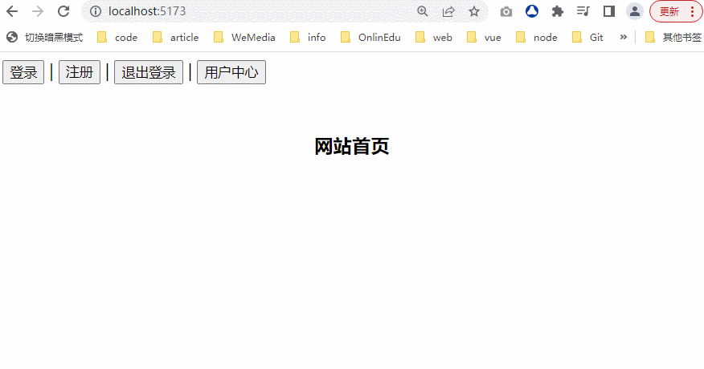
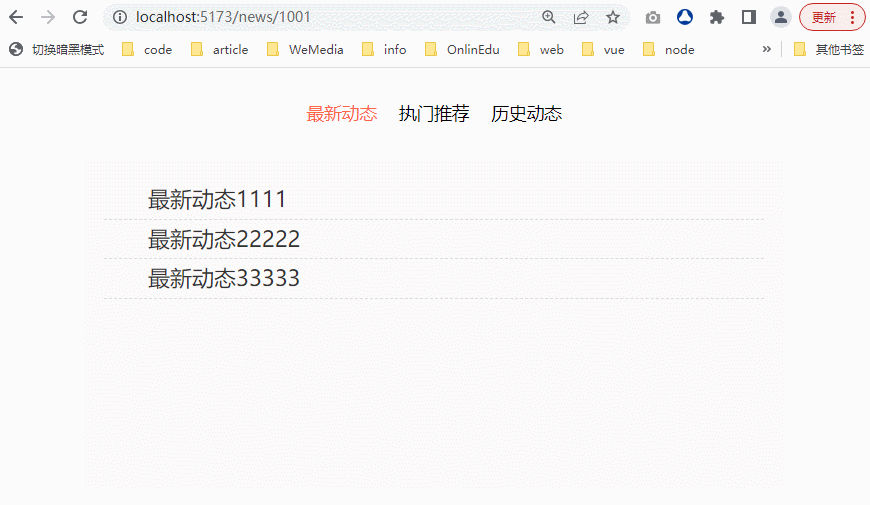
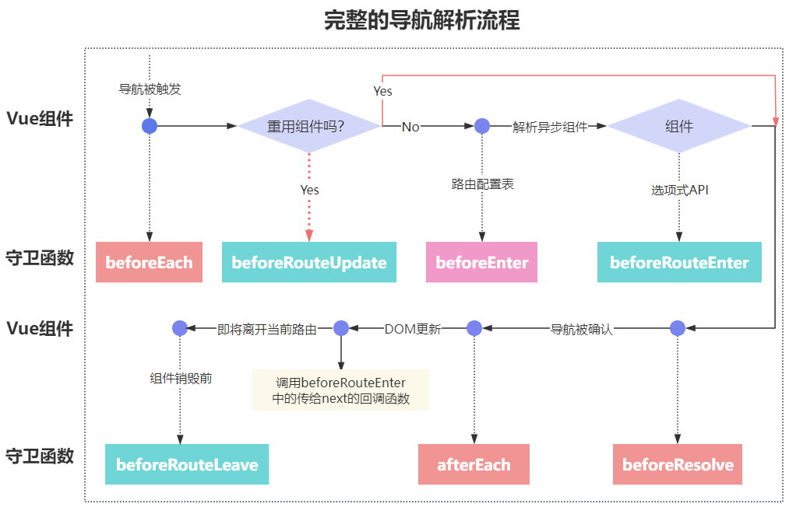
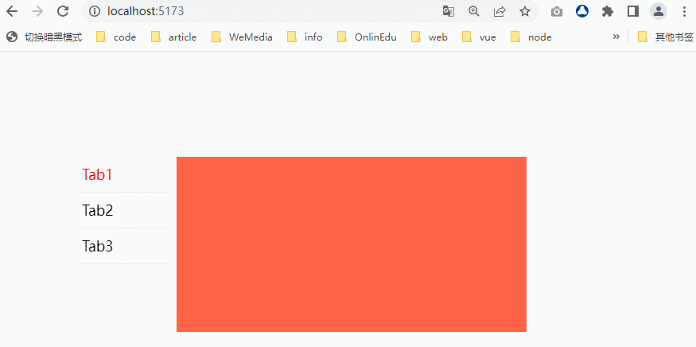
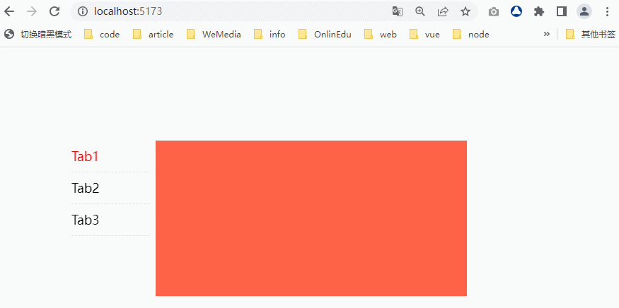
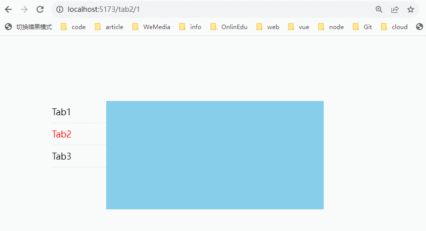
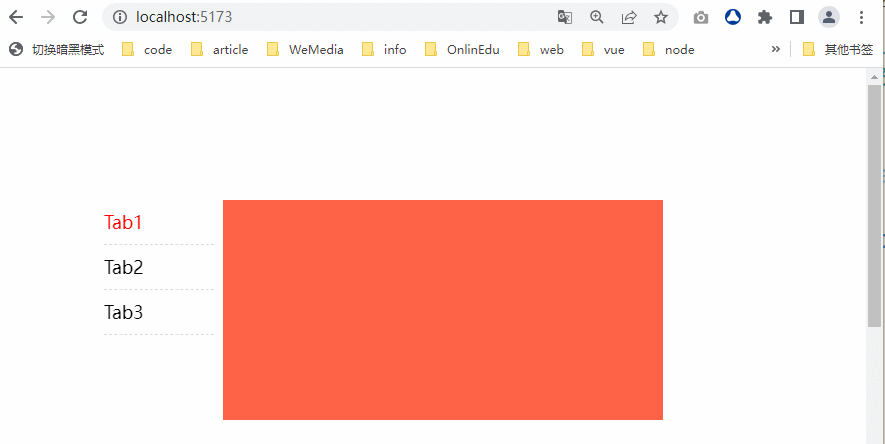
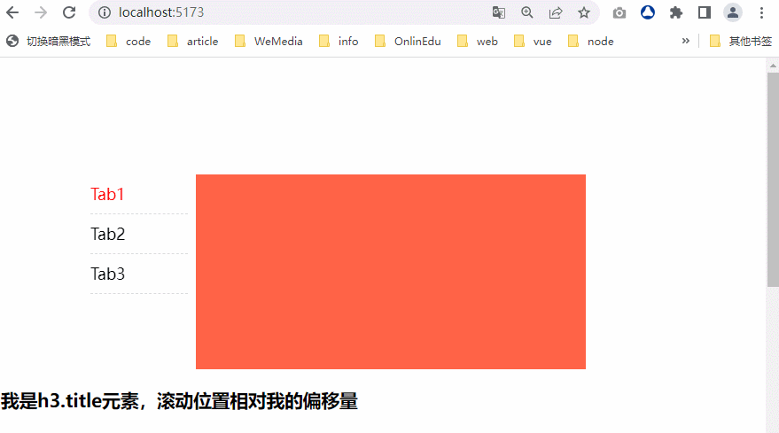
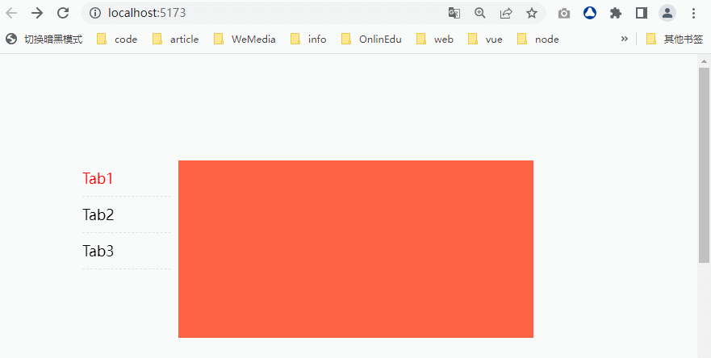

# Vue Router 导航守卫、过渡与滚动、懒加载、动态路由

从节内容开始我们重点学习以下内容：

- 导航守卫（路由守卫）
- 路由组件过渡动画
- 页面滚动行为
- 路由懒加载
- 动态路由匹配

## 一、导航守卫（路由守卫）

本小节主要讲解什么是导航守卫、导航守卫分类及实战应用。

### 1、什么是导航（路由）守卫

导航守卫是指从路由跳转开始到结束这一生命周期过程中的生命周期函数。

这些函数会在路由跳转开始到结束过程中的某个时刻执行， 这些函数也被称为 **“导航（路由）守卫函数”**。


注：

如果我们想在路由跳转到结束整个过程中的某个时刻做一些事情，就可以把想要做的事情写入对应的守卫函数中。

导航守卫函数常用来控制对路由的访问权限或路由跳转成功后要做的相关操作。比如：

- 对于没有访问权限的访问可以直接拒绝或跳转到其它页面等
- 在路由跳转时，在浏览器顶部实现页面加载的进度条效果，在加载成功后隐藏。
- 在路由跳转成功后修改网页标题的信息等

> 下图展示了用户没有登录时，无法进入到用户中心，只有登录后，才可以进入。



### 2、导航守卫分类

vue-router 提供了以下三类导航守卫来实现对路由的守卫

- 全局导航守
- 路由独享导航守卫
- 组件级导航守卫

### 3、全局导航守卫

全局导航守卫就是在路由跳转时，对整个应用内的所有路由进行拦截，然后进行一些操作。

全局导航守卫主要有以下三个钩子函数，所有路由跳转都会触发这三个钩子函数

- 全局前置守卫 beforeEach
- 全局解析守卫 beforeResolve
- 全局后置钩子 afterEach

> 全局导航守卫持载在全局路由实例上，如下：

```js
// 创建路由实例
const router = createRouter({
  // ...
})

// 添加全局前置守卫
router.beforeEach((to, from, next) => {
  // ...
})

// 全局解析守卫
router.beforeResolve((to, from, next) => {
  // ...
})

// 全局后置钩子  没有next参数
router.afterEach((to, from) => {
  // ...
})
```

### 4、全局前置守卫 beforeEach

当路由被触发时就会调用 beforeEach 钩子函数。比如：调用`router.push()`或`router.replace()`触发导航更新时，beforeEach 钩子函数就会调用。

**应用场景：**

常用于在路由跳转时对路由访问权限进行验证，验证通过放行，不通过做别做处理，比如返回首页。

**语法**

```js
// 创建路由实例
const router = createRouter({
  /*   */
})

// 添加全局前置守卫  next为可选参数
router.beforeEach((to, from, next) => {
  // ...
})
```

守卫方法参数

- to : 跳转到的目标路由对象。 比如从`/a`跳转到`/b`，目标路由对象为`/b`对应的路由对象
- from：离开的路由对象。 比如从`/a`跳转到`/b`，离开的路由对象为`/b`对应的路由对象

**守卫方法返回值**

- false ： 取消当前的导航，则会重置到 from 路由对应的地址
- 路由地址：可以是一个地址字符串，也可以是一个路由地址对象。和你调用`router.push()`方法传入的参数一样。
- true 或 undefined ： 表示当前导航有效，放行，并调用下一个导航守卫

**可选参数 next**

next：是一个方法，表示是否正常放行

> 在之前的 Vue Router 版本中会用到，在 vue Router4 中不考虑用，但也保留了这个功能

- 如果当前跳转是合法的，调用`next()`导航就可以正常跳转到目标路由
- `next(false)` 中断当前的导航，会返回到跳转前的路由
- `next()`方法也可以传递一个“路由字符串”或“路由对象”，表示跳转到一个新的路由

```js
next('/home')
next({ path: '/home' })
```

温馨提示：

如果不调用`next()`方法，切记不要在参数中出现`next`方法，否则路由没有办法跳转

### 5、实战应用：登录及权限控制

当点击对应的导航时会跳转到对应的页，但如果点击的是个人中心，则需要验证，验证通过则可以进入，否则会跳转到登录页。


实现原理

- 对于需要身份验证的路由，我们可以在路由配置上添加`meta: { requiresAuth: true}`字段，表示需要身份验证成功后方可进入。
- 添加全局前置导航守卫，在导航守卫中判断要进入的目标路由对象是否需要身份验证。
- 如果不需要验证，则直接放行，如果需要身份验证，则进入身份验证环节，判断用户是否登录成功。

```js
// 添加全局前置导航守卫
router.beforeEach((to, from, next) => {
  // 需要身份验证
  if (to.meta.requiresAuth) {
    // 判断用户是否登录
  } else {
    // 不需要身份验证，直接放行
    next()
  }
})
```

- 在`src/router/index.js`中定义 router 实例

```js
import { createRouter, createWebHistory } from 'vue-router'

import Home from '../views/Home.vue'
import User from '../views/User.vue'
import About from '../views/About.vue'
import Login from '../views/Login.vue'

const routes = [
  {
    path: '/',
    component: Home,
  },
  {
    path: '/about',
    component: About,
  },
  {
    path: '/user/:id',
    component: User,
    meta: {
      requiresAuth: true, // 需要身份验证
    },
  },
  {
    name: 'login',
    path: '/login',
    component: Login,
  },
]
const router = createRouter({
  history: createWebHistory(),
  routes,
})

// 全局前置守卫
router.beforeEach((to, from) => {
  console.log('全局前置守卫')
  console.log('to', to)
  console.log('from', from)

  // 判断进入当前路由是否需要验证
  if (to.meta.requiresAuth) {
    //....... 做相关验证

    // 验证通过放行 .......
    //  return true    或   啥也不写

    // 验证不通过，跳到登录页
    return '/login'
    // 或 return { name:'login' }
  }
})

export { router }
```

- `App.vue`中添加导航

```html
<template>
  <div class="router-link">
    <router-link to="/">网站首页</router-link>
    <router-link to="/about/">关于我们</router-link>
    <router-link to="/user/1001">个人中心</router-link>
    <router-link to="/login">登录</router-link>
  </div>
  <div class="router-view">
    <router-view></router-view>
  </div>
</template>
<style scoped>
  .router-link {
    display: flex;
    margin-top: 20px;
  }

  .router-link a {
    margin: 10px;
    text-decoration: none;
    color: #000;
  }

  .router-link a.router-link-active {
    color: red;
  }

  .router-view {
    font-size: 30px;
  }
</style>
```

运行以上程序，从路由`/`跳转到`/about`时，在控制台打印输出：


当从路由`/about`跳转到`/user/1001`时，因为验证失败，则会跳转到`/login`，则在控制台打印输出


### 6、优化版：登录及权限控制

在上面案例的基础上，我们添加登录功能，如下图：

- 如果用户没有登录，不允许进入个人中心，只能进入首页、关于我们、登录页、注册页
- 如果用户在没有登录的情况下访问用户中心页面，则会跳转到登录页
- 用户可以通过登录页输入用户名和密码进行验证，验证成功可以进入任意页面，包括个人中心。
- 如果点击了退出登录按扭，则回退出登录，返回到登录页，则不能再进入到用户中心，只能重新登录成功后才可以。


### 6.1、实现原理

- 对于需要身份验证的路由，我们可以在路由配置上添加`meta: { requiresAuth: true}`字段，表示需要身份验证成功后方可进入。
- 添加全局前置导航守卫，在导航守卫中判断要进入的目标路由对象是否需要身份验证。
- 如果不需要验证，则直接放行，如果需要身份验证，则进入身份验证环节，判断用户是否登录成功。

```js
// 添加全局前置导航守卫
router.beforeEach((to, from, next) => {
  // 需要身份验证
  if (to.meta.requiresAuth) {
    // 判断用户是否登录
  } else {
    // 不需要身份验证，直接放行
    next()
  }
})
```

- 我们可以在用户登录成功时，把后端发送的`token`保存在`locaStorage`中

```js
import { useRouter } from 'vue-router'
const router = useRouter()

// 点击登录按扭，会调用login方法进行登录验证
function login() {
  // 正常是发请求验证用户名和密码是否正确

  // 判断用户名和密码是否正确
  if (username.value === 'admin' && password.value === '123456') {
    // 验证成功，把后端发送的token保存在localStorage，此处模拟
    localStorage.setItem('token', 'xxxx-token')
    // 验证成功跳转到用户中心，带上用户id
    router.push('/user/1001')
  }
}
```

- 在`beforeEach`中判断是否有`token`，如果有表示用户登录成功，则放行；如果没有，则让用户跳转到登录页。（实际开发，需要把 token 发送给后端验证，验证通过则放行)

```js
// 全局前置守卫
router.beforeEach((to, from) => {
  // 判断进入当前路由是否需要验证
  if (to.meta.requiresAuth) {
    // 判断用户是否登录成功
    if (localStorage.getItem('token')) {
      return true
    } else {
      alert('没有访问权限！！请先登录')
      return '/login'
    }
  }
})
```

### 6.2、实现步骤

在前面案例的基础上，完善路由配置

```js
import { createRouter, createWebHistory } from 'vue-router'

import Home from '../views/Home.vue'
import User from '../views/User.vue'
import About from '../views/About.vue'
import Login from '../views/Login.vue'
import Register from '../views/Register.vue'

const routes = [
  {
    path: '/',
    component: Home,
  },
  {
    path: '/about',
    component: About,
  },
  {
    path: '/user/:id',
    component: User,
    meta: {
      requiresAuth: true,
    },
  },
  {
    name: 'login',
    path: '/login',
    component: Login,
  },
  {
    name: 'register',
    path: '/register',
    component: Register,
  },
]
const router = createRouter({
  history: createWebHistory(),
  routes,
})

// 全局前置守卫
router.beforeEach((to, from) => {
  // 判断进入当前路由是否需要验证
  if (to.meta.requiresAuth) {
    // 判断用户是否登录成功
    if (localStorage.getItem('token')) {
      return true
    } else {
      alert('没有访问权限！！请先登录')
      return '/login'
    }
  }
})

export { router }
```

- 完善路由需要用到的组件,在`/src/views`目录下新建`Register.vue`组件

```html
<template>注册个人账号....</template>
```

**完善登录页面界面开发和逻辑功能**

- 当用户点击登录按扭后，判断用户输的用户名和密码是否正确
- 如果正确则把后端返回的`token`保存在`localStorage`中，然后再跳转到用户中心界面。

```html
<script setup>
  import { ref } from 'vue'
  import { useRouter } from 'vue-router'
  const router = useRouter()
  const username = ref('') // 用户名
  const password = ref('') // 密码

  // 登录验证
  function login() {
    // 正常是发请求验证用户名和密码是否正确
    // 判断用户名和密码是否正确
    if (username.value === 'admin' && password.value === '123456') {
      // 验证成功，把后端发送的token保存在localStorage，此处模拟
      localStorage.setItem('token', 'xxxx-token')
      router.push('/user') // 验证成功跳转到用户中心
    }
  }
</script>

<template>
  <div class="login">
    <form>
      <div>
        <label for="username">用户名</label>
        <input type="text" v-model="username" id="username" />
      </div>
      <div>
        <label for="password">密码</label>
        <input type="password" v-model="password" id="password" autocomplete="none" />
      </div>
      <div>
        <button @click.prevent="login">登录</button>
      </div>
    </form>
  </div>
</template>

<style>
  .login {
    width: 300px;
  }

  .login div {
    margin-top: 20px;
  }

  .login div label {
    display: block;
    margin-bottom: 5px;
    font-size: 20px;
  }

  .login div input {
    width: 100%;
    box-sizing: content-box;
    border: 1px solid #ddd;
    height: 30px;
    line-height: 30px;
  }

  .login div button {
    box-sizing: border-box;
    width: 100%;
    height: 40px;
    border: none;
    font-size: 24px;
    color: #fff;
    background-color: tomato;
  }
</style>
```

- 在`App.vue`组件中，添加**注册**和**退出登录**，用以下内容替换之前的`App.vue`内容

```html
<script setup>
  import { useRouter } from 'vue-router'
  const router = useRouter()
  // 退出登录
  function exit() {
    // 退出登录时要清除掉token
    localStorage.setItem('token', '')
    // 跳转到首页
    router.push('/login')
  }
</script>
<template>
  <div class="router-link">
    <router-link to="/">网站首页</router-link>
    <router-link to="/about/">关于我们</router-link>
    <router-link to="/user/1001">个人中心</router-link>
    <router-link to="/login">登录</router-link>
    <router-link to="/register">注册</router-link>
    <a href="/" @click.prevent="exit">退出</a>
  </div>
  <div class="router-view">
    <router-view></router-view>
  </div>
</template>
<style scoped>
  .router-link {
    display: flex;
    margin-top: 20px;
  }

  .router-link a {
    margin: 10px;
    text-decoration: none;
    color: #000;
  }

  .router-link a.router-link-active {
    color: red;
  }

  .router-view {
    font-size: 30px;
  }
</style>
```

### 7、全局解析守卫 beforeResolve

全局解析守卫 beforeResolve 刚好在导航被确认之前调用，即地址栏中的地址改变为目标地址之前。在 beforeResolve 钩子调用前，所有组件内守卫和异步路由组件被解析完成。

**应用场景**：

- 获取数据：导航被确认后想马上做的事情，就可以在里，比如：获取数据
- 任何其他操作：如果用户无法进入页面时你希望避免执行的操作。比如：数据获取失败，则可以取消导航。

```js
// 创建路由实例
const router = createRouter({
  /*   */
})

// 全局解析守卫
router.beforeResolve((to, from, next) => {
  // ...
})
```

### 8、全局后置守卫 afterEach

- 当路由跳转成功后就会触发`afterEach`钩子函数，此时地址栏中路由地址改变为目标地址。
- 钩子函数的`to`和`from`用法与`beforeEach`一样，不过这个钩子函数没有`next`，因为路由已经跳转成功，在该钩子函数中并不能改变导航本身。

**应用场景：**

常用于分析导航跳转成功之后要做的事情，对于分析、更改页面标题等辅助功能以及许多其他事情都很有用

```js
// 创建路由实例
const router = createRouter({
  /*   */
})
//  全局后置钩子
router.afterEach((to, from) => {
  // 导航成功后，需要做的事情
})
```

**代码演示**：

导航跳转成功后修改页面标题

```js
const routes = [
  {
    path: '/',
    component: Home,
    meta: {
      title: '艾编程官网',
    },
  },
  {
    path: '/about',
    component: About,
    meta: {
      title: '关于我们',
    },
  },
  {
    path: '/user/:id',
    component: User,
    meta: {
      requiresAuth: true,
      title: '个人中心',
    },
  },
  {
    name: 'login',
    path: '/login',
    component: Login,
    meta: {
      title: '登录中心',
    },
  },
  {
    name: 'register',
    path: '/register',
    component: Register,
    meta: {
      title: '注册中心',
    },
  },
]
```

添加全局后置导航守卫，当页面跳转成功后修改页面标题

```js
//  全局后置导航守卫
router.afterEach((to, from) => {
  // 导航成功后，修改页面标题
  document.title = to.meta.title
})
```

### 9、导航加载进度条


实现原理：

首先创建 `LoadingBar` 组件，该组件有以下两个方法用来实现进度条的加载：

- `startLoading` 方法，调用该方法用于开始加载进度条
- `endLoading` 方法，调用该方法用于将进度条拉满，并结束进度条

同时将这两个方法通过 `defineExpose` 方法对外暴露为公共方法。这样在外部获取当前件实例时，就可以拿到这两个方法来实现进度条的加载。

- `LoadingBar.vue` 进度条组件

```html
<script setup>
  import { ref } from 'vue'
  const progress = ref(0) // 当前进度
  const speed = ref(1) // 动画速度
  const timer = ref(null) // 定时器
  const bar = ref(null) // 进度条

  // 开始加载进度条
  function startLoading() {
    progress.value = 0 // 每次加载时将进度改为0
    timer.value = window.requestAnimationFrame(function fn() {
      if (progress.value < 85) {
        progress.value += speed.value
        bar.value.style.width = progress.value + '%'
        timer.value = window.requestAnimationFrame(fn)
      } else {
        // 清除动画
        cancelAnimationFrame(timer.value)
      }
    })
  }
  // 进度条拉满，结束进度条
  function endLoading() {
    window.requestAnimationFrame(() => {
      setTimeout(() => {
        progress.value = 100
        bar.value.style.width = '100%'
        // 拉满后，过30ms去掉进度条
        setTimeout(() => {
          bar.value.style.width = '0%'
        }, 30)
      }, 1000)
    })
  }

  defineExpose({
    startLoading,
    endLoading,
  })
</script>
<template>
  <div class="wraps">
    <div class="loading-bar" ref="bar"></div>
  </div>
</template>

<style scoped>
  .wraps {
    width: 100%;
    height: 20px;

    position: fixed;
    top: 0;
    left: 0;
  }

  .wraps .loading-bar {
    height: inherit;
    width: 10px;
    background-color: red;
  }
</style>
```

- `/src/router/index.js`中

路由配置中

- 导航 `LoadingBar`组件，并利用 `createApp`方法创建应用实例，然后调用`mount`方法得到`LoadingBar`的组件实例。
- 在`router.beforeEach` 全局前置守卫中，调用 `LoadingBar`组件实例的`startLoading`方法开始加载进度条
- 在`router.afterEach` 全局后置守卫中，调用 `LoadingBar`组件实例的 `endLoading`方法将进度条拉满，并结束进度条

```js
import { createApp } from 'vue'
// 加载组件
import LoadingBar from '../components/loading-bar/LoadingBar.vue'
// 创建应用实例
const LoadingApp = createApp(LoadingBar)
const fragement = document.createDocumentFragment()
// loadingVm 进度条组件实例
const loadingVm = LoadingApp.mount(fragement)
// 将DOM挂载到页面
document.body.appendChild(fragement)

const router = createRouter({
  // ....
})

// 全局前置守卫
router.beforeEach((to, from) => {
  loadingVm.startLoading()
})
// 全局后置守卫
router.afterEach((to, from) => {
  loadingVm.endLoading()
})
```

**方法二：**

```js
import { h, render } from 'vue'
import LoadingBar from '../components/LoadingBar.vue'
const vnode = h(LoadingBar) // 虚拟DOM
render(vnode, document.body) // DOM挂载

// 全局前置守卫
router.beforeEach((to, from) => {
  vnode.component.exposed.startLoading()
})
// 全局后置守卫
router.afterEach((to, from) => {
  vnode.component.exposed.endLoading()
})
```

### 10、总结

全局导航守卫主要有以下三个钩子函数，所有路由跳转都会触发这三个钩子函数

| 全局守卫     | 钩子函数               | 触发时机                 | 作用                                                                                   |
| :----------- | :--------------------- | :----------------------- | :------------------------------------------------------------------------------------- |
| 全局前置守卫 | `router.beforeEach`    | 导航被触发时执行         | 在路由跳转时对路由访问权限进行验证，验证通过放行，不通过别做处理                       |
| 全局解析守卫 | `router.beforeResolve` | 刚好在导航被确认之前触发 | 是获取数据或执行任何其他操作（如果用户无法进入页面时你希望避免执行的操作）的理想位置。 |
| 全局后置钩子 | `router.afterEach`     | 在导航结束后调用         | 对于分析、更改页面标题、等辅助功能以及许多其他事情都很有用                             |

### 11、路由独享导航守卫

路由独享导航守只有`beforeEnter`一个钩子函数，当指定路由被进入时触发这个钩子函数。

它会在`router.beforeEach`和`beforeRouteUpdate`钩子之后执行。

| 钩子函数    | 触发时机                                                            | 作用                                                     |
| :---------- | :------------------------------------------------------------------ | :------------------------------------------------------- |
| beforeEnter | **只在进入路由时触发**，不会在 `params`、`query` 或 `hash` 改变时触 | 判断用户是否有权限访问当前路由，如果没有权限就跳转到首页 |

> 你可以直接在路由配置上定义`beforeEnter`守卫（函数）

```js
const routes = [
  {
    path: '/about',
    component: About,
    meta: {
      title: '关于我们',
    },
  },
  {
    path: '/user/:id',
    component: User,
    meta: {
      // requiresAuth:true,
      title: '个人中心',
    },
    // 路由独享导航守卫
    beforeEnter(to, from) {
      console.log('个人中心beforeEnter')
    },
  },
]
```

注意：针对以上路由

- 当我们从路由`/about`跳转到`/user/1001`时会触发`beforeEnter`钩子函数。
- 从路由`/user/1001`跳转到`/user/1002`时，不会触发`beforeEnter` 钩子函数。
- 当我们从路由`/about?a=1` 调转到`/about?a=2`时，不会触发`beforeEnter`钩子函数。

### 12、组件级导航守卫

组件级导航守卫是指组件内的钩子函数，类似于组件内的生命周期函数，当加载或更新指定组件时触发

> 组件级导航守卫有以下三个钩子函数

| 钩子函数          | 组合式 API          | 触发时机                               | 作用                                                                                                   |
| :---------------- | :------------------ | :------------------------------------- | :----------------------------------------------------------------------------------------------------- |
| beforeRouteUpdate | onBeforeRouteUpdate | 在当前路由改变，但是该组件被复用时调用 | 路由参数更新：当同一个组件在不同参数下进行切换时，可能需要根据新的参数更新组件的数据或状态             |
| beforeRouteEnter  | `/`                 | 在渲染该组件的对应路由被确认前调用     | 数据预加载：在进入组件之前，需要先加载一些数据                                                         |
| beforeRouteLeave  | onBeforeRouteLeave  | 在导航离开渲染该组件的对应路由时调用   | 数据清理：在离开当前路由之前需要执行一些清理操作，例如取消订阅事件、重置组件状态，或确认是否保证内容等 |

注意：

beforeRouteUpdate 与 beforeRouteEnter 两个钩子函数不会都触发，如果组件复用就会触发 beforeRouteUpdate 这个钩子，如果组件不复用，则会触发 beforeRouteEnter 钩子

> 组件级导航守卫是定义在 Vue 组件中，如下：

```html
<script>
  export default {
    beforeRouteEnter(to, from) {
      // 在渲染该组件的对应路由被验证前调用
      // 不能获取组件实例 `this` ！
      // 因为当守卫执行时，组件实例还没被创建！
    },
    beforeRouteUpdate(to, from) {
      // 在当前路由改变，但是该组件被复用时调用
      // 举例来说，对于一个带有动态参数的路径 `/users/:id`，在 `/users/1` 和 `/users/2` 之间跳转的时候，
      // 由于会渲染同样的 `UserDetails` 组件，因此组件实例会被复用。而这个钩子就会在这个情况下被调用。
      // 因为在这种情况发生的时候，组件已经挂载好了，导航守卫可以访问组件实例 `this`
    },
    beforeRouteLeave(to, from) {
      // 在导航离开渲染该组件的对应路由时调用
      // 与 `beforeRouteUpdate` 一样，它可以访问组件实例 `this`
    },
  }
</script>
```

组合式 API 中没有与`onBeforeRouteEnter` 对应的钩子函数

```html
<script setup>
  import { onBeforeRouteLeave, onBeforeRouteUpdate } from 'vue-router'
  onBeforeRouteUpdate((to, from) => {
    // ......  注意 this为undefined
  })

  onBeforeRouteLeave((to, from) => {
    // ......  注意 this为undefined
  })
</script>
```

### 12.1、beforeRouteEnter

`beforeRouteEnter` 守卫 **不能** 访问 `this`，因为守卫在导航确认前被调用，因此即将登场的新组件还没被创建。

不过，你可以通过传一个回调给 `next` 来访问组件实例。在导航被确认的时候执行回调，并且把组件实例作为回调方法的参数

```js
beforeRouteEnter (to, from, next) {
  next(vm => {
    // 通过 `vm` 访问组件实例
  })
}
```

注意

`beforeRouteEnter` 是支持给 `next` 传递回调的唯一守卫

### 12.2、onBeforeRouteUpdate 应用

对于一个带有动态参数的路径 `/news/:id`，在 `/news/1001` 和 `/news/1002` 之间跳转的时候，**相同的组件实例将被重复使用**，所以生周命期函数并不会被调用。

在`<script setup>`中并不能获取到变化后的参数。之前我们是采用侦听器来侦听`route`对象上的任意属性来实现

```js
// 侦听 route.params的变化
watch(
  () => route.params,
  (newValue, oldValue, onCleanup) => {
    // 对路由的变化做出响应
    axios.get(`${url}${newValue.id}`).then((res) => {
      // 发请求拿数据
    })
  },
)
```

有了`beforeRouteUpdate`钩子函数，我们也可以在这个钩子函数中获取变化后的参数，然后根据不同的参数 id 值来发请求获取数据

> 接下来利用`beforeRouteUpdate`钩子来实现如下效果



- `News.vue` 组件

```html
<script setup>
  import { ref, watch } from 'vue'
  import axios from 'axios'
  import { useRoute, onBeforeRouteUpdate } from 'vue-router'
  const route = useRoute()
  const list = ref([])
  const url = 'https://www.fastmock.site/mock/6ec78e345df340241e1f5043f0167833/icode/new/list/'

  // 用来取消请求的对象
  let controller = null
  function getData(id) {
    if (controller) {
      controller.abort()
    }
    controller = new AbortController()
    // // 发请求，拿数据
    axios
      .get(`${url}${id}`, {
        // 配置取消请求
        signal: controller.signal,
      })
      .then((res) => {
        list.value = res.data.data
      })
      .catch((err) => {
        console.log(err.message)
        console.log('取消了')
      })
  }

  // 未重用组件是调用该方法渲染数据
  getData(route.params.id)
  // 重用组件时
  onBeforeRouteUpdate((to, from) => {
    getData(to.params.id)
  })
</script>

<template>
  <ul>
    <li v-for="{ id, title } in list">
      <router-link to="">{{ title }}</router-link>
    </li>
  </ul>
</template>

<style scoped>
  ul {
    padding: 20px;
  }

  ul li {
    line-height: 35px;
    border-bottom: 1px dashed #ddd;
    text-indent: 2em;
  }

  ul li a {
    color: #333;
    text-decoration: none;
  }
</style>
```

- 路由定义

```js
const routes = [
  {
    name: 'news',
    path: '/news/:id',
    component: News,
  },
]
```

- 导航

```html
<router-link to="/news/1001">最新动态</router-link>
<router-link to="/news/1002">热门推荐</router-link>
<router-link to="/news/1003">历史动态</router-link>
```

### 12.3、onBeforeRouteLeave 应用

在离开导航前，可以弹出确认框确认是否要离开，如果确认是则跳到新目标，否则取消导航

```js
beforeRouteLeave(to, from) {
    const answer = window.confirm('确认要立开马？当前页面内容是否有保存？')
    if (!answer) return false
},
```

### 13、完整的导航解析流程



> 假设当前应用的路由配置如下：

```js
const routes = [
  {
    path: '/',
    component: Home,
  },
  {
    path: '/a/:id',
    component: A,
  },
  {
    path: '/b',
    component: B,
  },
]
```

注：

现在我们所在的页面路由为`/a/1`，接下来我们点击页面导航跳转到`/b`，整个导航解析流程如下：

- ①、导航被触发。（比如：调用 router.push、router.replace 等触发导航，但地址栏中导航没有发生变化）
- ②、在失活的组件里调用 `beforeRouteLeave` 守卫。 （从`/a/1`跳转到`/b`，`/a/1`路由对应的 A 组件将被销毁，**A 组件为失活的组件**。在执行 Unmounted 之前，会调用 beforeRouteLeave 进行拦截）
- ③、调用全局的 `beforeEach` 守卫。 （可以在这里验证用户是否有访问该路由权限，如果没有，直接返回首页，如果有就放行，会接着执行后面的钩子函数等）
- ④、在重用的组件里调用 `beforeRouteUpdate` 守卫(2.2+)。 （如果从`/a/1`跳转到`/a/2`时，会触发这个钩子函数，因为这两个路由重用同一个组件 A。如果从`'/a/1'`跳转到`'/b'`则不会触发这个钩子函数）
- ⑤、在路由配置里调用 `beforeEnter`。 （只针对指定的路由做拦截，判断用户是否有访问权限等）
- ⑥、解析异步路由组件。
- ⑦、在被激活的组件里调用 `beforeRouteEnter`。 （从`/a/1`跳转到`/b`，`/b`路由对应的 B 组件需要渲染成 DOM 挂载到页面，B 组件为激活的组件）
- ⑧、调用全局的 `beforeResolve` 守卫(2.5+)。
- ⑨、导航被确认。（地址栏中导航改变为跳转后地址）
- ⑩、调用全局的 `afterEach` 钩子。（导航成功后，可以修改页面标题等其它事情）
- ⑪、触发 DOM 更新。
- ⑫、调用 `beforeRouteEnter` 守卫中传给 `next` 的回调函数，创建好的组件实例会作为回调函数的参数传入

### 13.1、代码示例

实现如下图所示的效果，用来演示各个路由钩子的执行时机和顺序


> 页面路由如下

| 页面  | 路由   |
| :---- | :----- |
| Index | `/`    |
| A1    | `/a/1` |
| A2    | `/a/2` |
| B     | `/b`   |

- `router/index.js`中配置当前应用 router 实例，同时添加**全局导航守卫**和**路由独享守卫**

```js
import { createRouter, createWebHistory } from 'vue-router'

import Home from '../views/Home.vue'
import A from '../views/A.vue'
import B from '../views/B.vue'

const routes = [
  {
    path: '/',
    component: Home,
  },
  {
    path: '/a/:id',
    component: A,
  },
  {
    path: '/b',
    component: B,
  },
]
const router = createRouter({
  history: createWebHistory(),
  routes,
})

// 全局前置守卫
router.beforeEach(() => {
  console.log('全局前置守卫：beforeEach')
})

// 全局解析守卫
router.beforeResolve(() => {
  console.log('全局解析守卫：beforeResolve')
})
// 全局后置钩子
router.afterEach(() => {
  console.log('全局后置钩子：afterEach')
})
export { router }
```

- 定义路由组件，并在路由组件中定义**组件级导航守卫**

```html
<!--A.vue-->
<script setup>
  import { onBeforeRouteLeave, onBeforeRouteUpdate } from 'vue-router'

  onBeforeRouteLeave(() => {
    console.log('A---', 'onBeforeRouteLeave')
  })

  onBeforeRouteUpdate(() => {
    console.log('A---', 'onBeforeRouteUpdate')
  })
</script>

<template>A组件.......</template>
<script setup>
  import { onBeforeRouteLeave, onBeforeRouteUpdate } from 'vue-router'

  onBeforeRouteLeave(() => {
    console.log('B---', 'onBeforeRouteLeave')
  })

  onBeforeRouteUpdate(() => {
    console.log('B---', 'onBeforeRouteUpdate')
  })
</script>

<template>B组件.......</template>
```

- `App.vue`中定义导航及视图渲染

```html
<template>
  <div class="router-link">
    <router-link to="/">Index</router-link>
    <router-link to="/a/1">A1</router-link>
    <router-link to="/a/2">A2</router-link>
    <router-link to="/b">B</router-link>
  </div>
  <div class="router-view">
    <router-view></router-view>
  </div>
</template>
<style scoped>
  .router-link {
    display: flex;
    margin-top: 20px;
  }

  .router-link a {
    margin: 10px;
    text-decoration: none;
    color: #000;
  }

  .router-link a.router-link-active {
    color: red;
  }

  .router-view {
    font-size: 30px;
  }
</style>
```

> 按以上结构搭建好后，我们启动项目，跳转到`/b`页面。

- 当我们从`/b`跳转到`/a/1`时，控制台打印出下如结果


- 当我们从`/a/1`跳转到`/a/2`时，控制台打印出如下结果：


### 14、总结

本小节需要常握以下几个知识点

**什么是导航守卫**

导航守卫是指从路由跳转开始到结束这一生命周期过程中的生命周期函数

**导航守卫分类**

导航守卫分为：全局导航守卫、路由独享守卫、组件级导航守卫

**各守卫函数执行时机和应用场景**

| 分类           | 钩子函数            | 触发时机                                                            | 作用                                                                                                   |
| :------------- | :------------------ | :------------------------------------------------------------------ | :----------------------------------------------------------------------------------------------------- |
| 全局前置守卫   | `beforeEach`        | 导航被触发时执行                                                    | 在路由跳转时对路由访问权限进行验证，验证通过放行，不通过别做处理                                       |
| 全局解析守卫   | beforeResolve       | 刚好在导航被确认之前触发                                            | 是获取数据或执行任何其他操作（如果用户无法进入页面时你希望避免执行的操作）的理想位置。                 |
| 全局后置守卫   | `afterEach`         | 在导航结束后调用                                                    | 对于分析、更改页面标题、等辅助功能以及许多其他事情都很有用                                             |
| 路由独独享守卫 | `beforeEnter`       | **只在进入路由时触发**，不会在 `params`、`query` 或 `hash` 改变时触 | 判断用户是否有权限访问当前路由，如果没有权限就跳转到首页                                               |
| 组件级守卫     | `beforeRouteUpdate` | 在当前路由改变，但是该组件被复用时调用                              | 路由参数更新：当同一个组件在不同参数下进行切换时，可能需要根据新的参数更新组件的数据或状态             |
| 组件级守卫     | beforeRouteEnter    | 在渲染该组件的对应路由被确认前调用                                  | 数据预加载：在进入组件之前，需要先加载一些数据                                                         |
| 组件级守卫     | `beforeRouteLeave`  | 在导航离开渲染该组件的对应路由时调用                                | 数据清理：在离开当前路由之前需要执行一些清理操作，例如取消订阅事件、重置组件状态，或确认是否保证内容等 |

> 完整的导航解析流程


## 二、路由组件过渡动画

深入浅出路由组件过渡动画、单个路由过渡动画、基于路由的动态过渡在实际项目开发中的实践。

### 1、路由组件过渡动画

如果我们想在路由组件上使用过渡动画，可以使用`<router-view>`组件的插槽功能。

> 以下代码，所有路由组件在过渡时采用的是统一的过渡动画

```html
<!-- route 为当前路由对象  Component 为当前路由显示的组件-->
<router-view v-slot="{route, Component }">
  <transition name="fade">
    <component :is="Component" />
  </transition>
</router-view>
```

注意：

上面`v-slot`中的`Component`的首字母要大写

**代码示例**

> 当在不同的路由间进行切换时，被渲染的路由组件以淡入淡出的效果显示



- 定义路由

```js
import { createRouter, createWebHistory } from 'vue-router'
import Tab1 from '../views/Tab1.vue'
import Tab2 from '../views/Tab2.vue'
import Tab3 from '../views/Tab3.vue'

// 定义一些路由
const routes = [
  {
    name: 'tab1',
    path: '/',
    component: Tab1,
  },
  {
    name: 'tab2',
    path: '/tab2',
    component: Tab2,
  },
  {
    name: 'tab3',
    path: '/tab3',
    component: Tab3,
  },
]

// 创建路由实例
const router = createRouter({
  history: createWebHistory(),
  routes,
})

export { router }
```

- 定义三个视图组件`Tab1`、`Tab2`、`Tab3`，内容如下

```html
<!--Tab1 组件-->
<template>
  <div class="tab tab1"></div>
</template>
<style>
  .tab1 {
    width: 400px;
    height: 200px;
    background-color: tomato; /* 红色 */
  }
</style>

<!--Tab2 组件-->
<template>
  <div class="tab tab2"></div>
</template>
<style>
  .tab2 {
    width: 400px;
    height: 200px;
    background-color: skyblue; /* 蓝色 */
  }
</style>

<!--Tab3 组件-->
<template>
  <div class="tab tab3"></div>
</template>
<style>
  .tab3 {
    width: 400px;
    height: 200px;
    background-color: khaki; /* 黄色 */
  }
</style>
```

- `App.vue`中创建路由链接和路由视图出口，并对路由组件使用过渡动画

```html
<template>
  <ul class="router-link">
    <li><router-link to="/">Tab1</router-link></li>
    <li><router-link to="/tab2">Tab2</router-link></li>
    <li><router-link to="/tab3">Tab3</router-link></li>
  </ul>
  <div class="router-view">
    <router-view v-slot="{ route, Component }">
      <Transition name="fade" mode="out-in">
        <component :is="Component"></component>
      </Transition>
    </router-view>
  </div>
</template>
<style scoped>
  /* 导航样式 */
  .router-link {
    position: fixed;
    width: 100px;
    height: 200px;
    left: 100px;
  }

  .router-link li {
    list-style: none;
    line-height: 40px;
    border-bottom: 1px dashed #ddd;
  }

  .router-link li a {
    text-decoration: none;
    color: #000;
  }

  .router-link li a.router-link-active {
    color: red;
  }

  .router-view {
    height: 200px;
    width: 400px;
    margin-left: 200px;
    margin-top: 120px;
    overflow: hidden;
  }

  /* 过渡动画样式 */
  .fade-enter-from,
  .fade-leave-to {
    opacity: 0;
  }

  .fade-enter-active,
  .fade-leave-active {
    transition: all 1s ease;
  }
</style>
```

### 2、单个路由过渡动画

上面的用法会对所有的路由使用相同的过渡，如果你想让每个路由的组件有不同的过渡。

> 如下图：



你可以将`meta`路由元信息和动态的 `name` 或 自定义过渡 class 结合在一起，放在`<transition>` 上

```html
<router-view v-slot="{ route, Component }">
  <Transition :name="route.meta.transition ">
    <component :is="Component" />
  </Transition>
</router-view>
<router-view v-slot="{ route, Component }">
  <Transition
    :enter-active-class="route.meta.enterTransition"
    :leave-active-class="route.meta.leaveTransition"
    mode="out-in"
  >
    <component :is="Component" />
  </Transition>
</router-view>
```

**完整代码示例**

- 在前面案例的基础上，把每个路由组件需要的动画名配置在`meta`项中。

> 以下动画名采用的是第三方的`animate.css`插件库的动画名

```js
import { createRouter, createWebHistory } from 'vue-router'
import Tab1 from '../views/Tab1.vue'
import Tab2 from '../views/Tab2.vue'
import Tab3 from '../views/Tab3.vue'

// 定义一些路由
const routes = [
  {
    name: 'tab1',
    path: '/',
    component: Tab1,
    meta: {
      enterTransition: 'animate__backInDown',
      leaveTransition: 'animate__backOutDown',
    },
  },
  {
    name: 'tab2',
    path: '/tab2',
    component: Tab2,
    meta: {
      enterTransition: 'animate__backInLeft',
      leaveTransition: 'animate__backOutLeft',
    },
  },
  {
    name: 'tab3',
    path: '/tab3',
    component: Tab3,
    meta: {
      enterTransition: 'animate__backInUp',
      leaveTransition: 'animate__backOutUp',
    },
  },
]

// 创建路由实例
const router = createRouter({
  history: createWebHistory(),
  routes,
})

export { router }
```

- `<Transition>`组件的过渡 class 直接从`route.meta`中读取

```html
<script setup>
  import 'animate.css' // 要先执行 npm install animate.css --save 命令安装
</script>

<template>
  <ul class="router-link">
    <li><router-link to="/">Tab1</router-link></li>
    <li><router-link to="/tab2">Tab2</router-link></li>
    <li><router-link to="/tab3">Tab3</router-link></li>
  </ul>
  <div class="router-view">
    <router-view v-slot="{ route, Component }">
      <Transition
        :enter-active-class="`animate__animated ${route.meta.enterTransition}`"
        :leave-active-class="`animate__animated ${route.meta.leaveTransition}`"
        mode="out-in"
      >
        <component :is="Component" />
      </Transition>
    </router-view>
  </div>
</template>

<style scoped>
  /* ....*/
</style>
```

> 进过以上两步，就完成了上图所示的动画效果。

### 3、基于路由的动态过渡

也可以根据目标路由和当前路由之间的关系，动态地确定使用的过渡。

> 如下图：



当从`/tab2/1`跳到`/tab1`时，采用的是淡入淡出动画。当从`tab1`跳转到`/tab2/1`时，采用的是左右滑动动画。 我们可以根据目标路由与当前路由的深度来决定采用何种动画过渡。

**代码实现**

```html
<!-- 使用动态过渡名称 -->
<router-view v-slot="{ Component, route }">
  <transition :name="route.meta.transition">
    <component :is="Component" />
  </transition>
</router-view>
```

我们可以在`router.afterEach`导航后置守卫中，根据路径的深度动态添加信息到 `meta` 字段，来决定当前路由组件的过渡动画

```js
router.afterEach((to, from) => {
  const toDepth = to.path.split('/').length
  const fromDepth = from.path.split('/').length
  to.meta.transition = toDepth < fromDepth ? 'fade' : 'slide'
})
```

### 4、强制在复用的视图之间进行过渡

Vue 可能会自动复用看起来相似的组件，从而忽略了任何过渡。幸运的是，可以**添加一个 `key` 属性**来强制过渡。

> 这也允许你在相同路由上使用不同的参数触发过渡

```html
<router-view v-slot="{ Component, route }">
  <transition name="fade">
    <component :is="Component" :key="route.path" />
  </transition>
</router-view>
const routes = [ { name: "tab2", path: "/tab2/:id", component: Tab2, }, ];
<div class="menu">
  <div><router-link to="/tab2/1">Tab2-1</router-link></div>
  <div><router-link to="/tab2/2">Tab2-2</router-link></div>
  <div><router-link to="/tab2/3">Tab2-3</router-link></div>
</div>
```

注：

如果`<component :is="Component" :key="route.path" />`中没有添加`:key`属性，从`/tab2/`跳转到`/tab2/2`或`/tab2/3`时，并不会有过渡动画。

## 三、页面滚动行为

使用前端路由，当切换到新的路由时，想要滚动到页面顶部，或者保持原先的滚动位置是可以做到的。

**注意：**

这个功能只在支持 history.pushState 的浏览器中可用。

> 我们需要在创建 Router 实例时，提供一个`scrollBehavior`方法

```js
const router = createRouter({
  history: createWebHistory(),
  routes,
  // to 目标路由
  // from 离开页面路由
  // savedPosition 保存当前路由滚动的位置  只有当这是一个 popstate 导航时才可用（由浏览器的后退/前进按钮触发）
  scrollBehavior(to, from, savedPosition) {
    // return 你期望滚动到的位置
  },
})
```

**scrollBehavior 函数返回值**

- 返回值如果为一个空对象，表示路由切换时不发生滚动
- 如果是包含以下属性的对象，会滚动到你所设置的位置

```js
{
    // el 值为一个css选择器或一个DOM元素
    // 在没有el属性时，top与left值分表示滚动条与浏览器顶部与左边距离
    // 有el属性时，top值与left值是相对于el选中元素的位置偏移量
	top:0,
	left:0,
    // 值是一个css选择器或获取的DOM元素
	el:'.title'  // document.querySelector('.title')
    behavior：'smooth' // 平滑滚动
}
```

- 如果返加一个`Promise`对象， 则表示期望在等待一定时间后再滚动到指定位置，比如：当前页面有过渡动画，希望在过渡动画结束后再来滚动。

```js
const router = createRouter({
  scrollBehavior(to, from, savedPosition) {
    return new Promise((resolve, reject) => {
      //  在 500秒后，再滚动浏览器顶部
      setTimeout(() => {
        resolve({ left: 0, top: 0 })
      }, 500)
    })
  },
})
```

### 1、滚动到页面顶部

以下代码中`scrollBehavior`函数的返回值，表示进入页面时，滚动条滚动到页面顶部

```js
scrollBehavior(to, from, savedPosition) {
    return {top:0}  // 进入页面时，滚动条滚动到页面顶部
    // return {top:0,left:0}
}
```



### 2、滚动到指定元素偏移位置

以下代码中`scrollBehavior`的返回值，表示进入`/tab2/1001`页面时，滚动到`h3.title`元素顶部所在位置，其它情况滚动到浏览器的顶部。

```js
scrollBehavior(to, from, savedPosition) {
    if(to.path==='/tab2/1001'){
        return {
            // 滚动值top，为相对路由组件中 h3.title元素的偏移量
            el: 'h3.title',
            top: 0
        }
    }else{
        return {
            top:0
        }
    }

}
```

我们在`App.vue`文件`.main`元素下添加`h3.title`元素

```html
<div class="main">
  <!-- 部分代码省略-->
</div>
<h3 class="title">我是h3.title元素，滚动位置相对我的偏移量</h3>
```



### 3、保持原先滚动位置

- 当通过浏览器的浏览器的 后退 / 前进 按钮返回到原来页面时，会滚动到原先滚动的位置。
- 如果不是通过后退和前进按扭，则滚动到浏览器顶部。



**代码如下：**

```js
scrollBehavior(to, from, savedPosition) {
    // savedPosition 保存当当前路由的滚动位置
    // 只有当这是一个 popstate`导航时才可用（由浏览器的后退/前进按钮触发），所以针对前进和后退按扭可以滚动到原先位置，其它的情况则不行。
    console.log(savedPosition)

    // 有值，表示是浏览器前进后退按扭触发导航，则可以返回到原位置，否则返回到顶部
    if (savedPosition) {
        return savedPosition
    } else {
        return {
            top: 0,
            behavior: 'smooth'
        }
    }
}
```

### 4、滚动到锚点

当我们点击锚点链接时，能平滑滚动到页面的锚点所在位置，如下图


**代码实现**

我们在`Tab1`组件中添加锚点链接和锚点要跳转到位置

```html
<div class="tab tab1">
  <!-- 锚点链接 -->
  <router-link to="#ab">锚点链接</router-link>
  <h1 style="height:1000px"></h1>
  <!-- 锚点位置-->
  <div id="ab"></div>
</div>
```

添加以下配置使滚动条平滑滚动到锚点所在位置

```js
// 创建路由实例
const router = createRouter({
  history: createWebHistory(), // history模式
  routes,
  scrollBehavior(to, from, savedPosition) {
    // 判断是否有hash值，如果有hash值，则跳转到指定hash值（锚点所链接位置）
    if (to.hash) {
      return {
        el: to.hash,
        behavior: 'smooth',
      }
    }
  },
})
```

### 5、延迟滚动

当进入到页面后，会先执行路由组件过渡动画，2 秒后动画执行完，滚动条再滚动到与浏览器顶部`100px`的位置


**代码如下**

```js
scrollBehavior(to, from, savedPosition) {
        return new Promise((resolve, reject) => {
            // 2秒后，滚动条再开始平滑滚动到与浏览器顶部100px位置
            setTimeout(() => {
                resolve({
                    top: 100,
                    left: 0,
                    behavior: 'smooth'
                })
            }, 2000)
        })
    }
```

## 四、路由懒加载

深入浅出路由懒加载，静态与动态加载组件对比具体实践。

### 1、路由懒加载

- 路由懒加载是指按需加载路由所需的组件，即用到该组件就加载，没用到就不加载
- 使用`import()`函数就可以实现动态导入（按需加载）组件

```js
// import() 动态加载组件，我们并不需要他一上来就加载，而是希望在用到时才加载，所以我们把import()作为箭头函数的返回值
const Tab3 = () => import('../views/Tab3.vue')

// 需要加载组件时，调用Tab3，加载Tab3组件
Tab3()
```

- 在定义路由时，`component`和`components`配置可以接收一个返回 Promise 组件的函数。

```js
const routes = [
  {
    name: 'tab3',
    path: '/tab3',
    // 以下import()方法本身返回的是一个Promise组件函数
    component: () => import('../views/Tab1.vue'),
  },
]

// 或
const routes = [
  {
    name: 'tab3',
    path: '/tab3',
    // 接受一个返回Promise组件函数
    component: () =>
      Promise.resolve({
        render() {
          return h('div', '动态导入组件Tab2')
        },
      }),
  },
]
```

**代码演示**

把之前案例中`router/index.js`中定义路由相关代码替换成如下

```js
// 定义一些路由
const routes = [
  {
    name: 'tab1',
    path: '/',
    // 动态加载组件
    component: () => import('../views/Tab1.vue'),
    meta: {
      enterTransition: 'animate__backInDown',
      leaveTransition: 'animate__backOutDown',
    },
  },
  {
    name: 'tab2',
    path: '/tab2',
    // 动态加载组件
    component: () => import('../views/Tab2.vue'),
    meta: {
      enterTransition: 'animate__backInLeft',
      leaveTransition: 'animate__backOutLeft',
    },
  },
  {
    name: 'tab3',
    path: '/tab3',
    // 动态加载组件
    component: () =>
      Promise.resolve({
        // 定义组件
        setup() {
          const msg = ref('Hello 动态加载组件')
          return () => h('div', msg.value)
        },
      }),
    meta: {
      enterTransition: 'animate__backInUp',
      leaveTransition: 'animate__backOutUp',
    },
  },
]
```

以下是渲染后效果

- 初次加载应用时，并不会加载没有用到的`Tab2`和`Tab3`组件，所以初次加载应用会非常快
- 当我们点击`Tab2`导航进入当前路由时，才会加载`Tab2`组件，并将组件缓存起来，当后面再次进到`Tab2`页面，不会再加载对应组件，而是会从缓存中读取。
- 当我们点击`Tab3`导航进入当前路由时，才会调用`component`后面的函数，渲染 DOM，插入页面


### 2、静态与动态加载组件对比

- 使用`import`关键字来加载组件，属于静态加载
- 静态导入组件有一个很大的弊端，在初次加载应用时，不管是否用到该路由，都会加载该组件，所以造成应用初次加载会很慢。

```js
// 静态导入组件
import Tab1 from '../views/Tab1.vue'
```

- 使用`import()`函数来加载组件，属于动态加载组件
- 动态导入组件实现按需加载所需组件，所以初次加载应用时，用不到的组件不会加载，首次加载应用会很快，性能更好。

```js
// 动态导入组件
const Tab1 = () => import('../views/Tab1.vue')
```

温馨提示：

对于单页面开发，对所有的路由都实现按需加载是非常好的，这样初始加载应用时速度会更快，更高效。

## 五、动态路由

对路由的添加通常是通过`createRouter`构造函数的配置项`routes`选项来完成的。

但有些情况下，我们需要在程序运行时动态的添加或删除路由，我们可以调用`router`实例的相关方法来完成。

### 1、添加路由

- 调用`router.addRoute()`方法实现添加路由，只是添加路由到 routes 选项中，并不会发生页面导航行为
- 在`router.addRoute()`中传入一个路由对象作为参数，会动态添加该路由到`routes`选项中

```js
router.addRoute({ name: 'tab1', path: '/tab1', component: Tab1 })
```

### 2、添加嵌套路由

如果需要为某个路由添加嵌套的子路由，可以将该路由的名字作为第一个参数传递给`router.addRoute()`，需要添加的子路由作为第二个参数传入。

```js
// 添加路由
router.addRoute({ path: '/user', name: 'user', component: User })
// 为上一条路由添加子路由
router.addRoute('user', { path: 'info', name: 'info', component: Info })
```

以上两条代码执行后，相当于在`routes`选项中添加了如下路由

```js
const routes = [
  {
    path: '/user',
    name: 'user',
    component: User,
    children: [
      {
        path: 'info',
        name: 'info',
        component: Info,
      },
    ],
  },
]
```

### 3、删除路由

删除`routes`选项中的某个路由，有以下三种方式

- 添加一个已存在的同名（`name`值相同）路由，则会先删除原路由，再加添新路由

```js
router.addRoute({ name: 'tab1', path: '/tab1', component: Tab1 })
// 最终以下面这个为主
router.addRoute({ name: 'tab1', path: '/', component: Home })
```

- 通过调用`router.addRoute()`返回的回调，针对没有名字的路由，这个方式很有用

```js
const removeRoute = router.addRoute({
  name: 'tab1',
  path: '/tab1',
  component: Tab1,
})

//  删除路由如果存在的话
removeRoute()
```

- 通过调用`router.removeRoute()`按路由名称来删除路由

```js
router.addRoute({ path: '/tab2', name: 'tab2', component: Tab2 })
// 删除路由
router.removeRoute('tab2')
```

注：

当路由被删除时，所有与该路由相关的内容都会被删除，也就是`routes`选项中没有该项

### 4、查看现有路由

- `router.hasRoute()`方法用于检查一个给定名称的路由是否存在，存在返回 true，不存在返回 false

```js
router.hasRoute('user') // user为路由名称，存在返回true,不存在返回false
```

- `router.getRoutes()` 方法能获得所有**路由记录**的完整列表

```js
const routes = router.getRoutes() // 相当于返回 路由定义中的routes
```

### 5、演示案例

- 当前项目的 routes 选项，默认只配置了一个路由，其它全都通过动态形式来添加

```js
import { createRouter, createWebHistory } from 'vue-router'

// 定义一些路由
const routes = [
  {
    name: 'home',
    path: '/',
    component: () => import('../views/Home.vue'),
  },
]

// 创建路由实例
const router = createRouter({
  history: createWebHistory(),
  routes,
})

export { router }
```

- `App.vue`组件

```html
<script setup>
  import { ref } from 'vue'

  const removeRoute = ref(null)
  import { useRouter } from 'vue-router'
  const router = useRouter()
  // 添加路由Tab1 和 user 及 user子路由
  function addRoute1(nameOrRoute, route) {
    if (arguments.length === 1) {
      router.addRoute(nameOrRoute)
    } else {
      router.addRoute(nameOrRoute, route)
    }
  }

  // 添加路由Tab2
  function addRoute2() {
    removeRoute.value = router.addRoute({
      name: 'tab2',
      path: '/tab2',
      component: () => import('./views/Tab2.vue'),
    })
  }

  // 移除路由Tab1
  function removeRoute1(route) {
    router.removeRoute(route)
  }

  // 删除路由2
  function removeRoute2() {
    removeRoute.value()
  }

  // 查看当前所有路由记录
  function getRoutes() {
    console.log(router.getRoutes())
  }
</script>

<template>
  <button
    @click="addRoute1({ name: 'tab1', path: '/tab1', component: () => import('./views/Tab1.vue') })"
  >
    添加 / tab1路由
  </button>
  |
  <button @click=" addRoute2()">添加/tab2路由</button>

  <br />
  <br />
  <button @click="removeRoute1('tab1')">按名路由名删除/tab1路由</button>
  |
  <button @click="removeRoute2()">按addRoute回调删除/tab2路由</button>

  <br />
  <br />
  <button
    @click="addRoute1({ name: 'user', path: '/user', component: () => import('./views/user.vue') })"
  >
    添加/user路由
  </button>
  |
  <button
    @click="addRoute1('user', { path: 'info', name: 'info', component: () => import('./views/Info.vue') })"
  >
    添加user子路由
  </button>

  <button @click="getRoutes">查看当前所有路由记录</button>

  <br />
  <br />
  <div class="menu">
    <router-link to="/">home</router-link>
    |
    <router-link to="/tab1">tab1</router-link>
    |
    <router-link to="/tab2">tab2</router-link>
    |
    <router-link to="/user">user</router-link>
  </div>

  <div class="main">
    <router-view></router-view>
  </div>
</template>

<style>
  .main {
    margin-top: 30px;
    display: flex;
    justify-content: center;
    align-items: center;
  }
</style>
```

- User 组件中内容如下，其它路由子组件内容，大家可以自己随意添加

```html
<template>
  <div>
    <h3>用户中心</h3>
    <div class="menu">
      <router-link to="/user/info">Info</router-link>
    </div>

    <div>
      <router-view></router-view>
    </div>
  </div>
</template>
```

> 最终渲染后效果如下：


注：

- 刚开始，除了网站首页能访问，其它路由都不存在，则都无法访问，控制台抛出一堆警告
- 点击添加`/tab1`与`/tab2`路由后，两路由可正常访问
- 添加删除`/tab1`与`/tab2`路由后，两路由失效，无法访问
- 点击添加`/user`路由后，`/user`路由可访问，但其子路由`/user/info`还没法访问
- 点击添加`/user`子路由后，则`/user/info`路由可正常访问
- 最后点击查看当前所有路由记录，打印结果见上图
