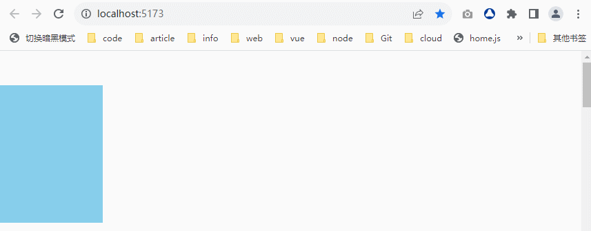

# Vue 中的 Teleport 内置组件

`<Teleport>` 是一个内置组件，它可以将一个组件内部的一部分模板 “传送” 到该组件的 DOM 结构外层的位置去。

> `<Teleport>`组件相关内容如下：

- to 属性
- 为什么需要 Teleport 组件
- 搭配组件使用
- 禁用 Teleport
- 实战应用：根据屏幕尺寸渲染县浮窗
- 多个 Teleport 共享目标

## 1、to 属性

`<Teleport>` 接收一个 `to` prop 来指定传送的目标。`to` 的值可以是一个 CSS 选择器字符串，也可以是一个 DOM 元素对象。

```html
<Teleport to="#id"></Teleport>
<Teleport to=".class"></Teleport>
<Teleport to="[title='xxx']"></Teleport>
<Teleport to="tagname"></Teleport>
```

**代码示例**

下面`Modal`组件中这段代码的作用就是告诉 Vue“把`<Teleport>`中的模板片段传送到 `body` 标签下"。

```html
<!--Modal组件-->
<Teleport to="body">
  <div class="modal-mask">
    <div class="modal-container">弹窗</div>
  </div>
</Teleport>
```

在 App 根组件中使用 Modal 组件

```html
<script setup>
  import Modal from './components/Modal.vue'
</script>

<template>
  <div class="main">
    <Modal></Modal>
  </div>
</template>
```

以上代码最终渲染后的 HTML 结构如下，`.modal-mask`对应的 Div 从`.main`中移除添加到了 body 中

```html
<body>
  <div id="app">
    <div class="main">
      <!--.modal-maks从这里被移除，添加到了body中-->
    </div>
  </div>
  <!--.modal-mask被添加到了body中-->
  <div class="modal-mask">
    <div class="modal-container">弹窗</div>
  </div>
</body>
```

## 2、注意事项

`<Teleport>` 挂载时，传送的 `to` 目标必须已经存在于 DOM 中。理想情况下，这应该是整个 Vue 应用 DOM 树外部的一个元素。

如果目标元素也是由 Vue 渲染的，你需要确保在挂载 `<Teleport>` 之前先挂载该元素。

**以下为错误示例**

> 因为`<Teleport>`挂载前，`h3.title`元素还没有被挂载到页面中

```html
<div class="main">
  <Teleport to="h3.title">
    <div class="a">A</div>
  </Teleport>
</div>
<h3 class="title"></h3>
```

**以下为正确示例**

```html
<h3 class="title"></h3>
<div class="main">
  <Teleport to="h3.title">
    <div class="a">A</div>
  </Teleport>
</div>
```

## 3、为什么需要 Teleport 组件

在实际开发中我们可能会遇到这样的场景：

一个组件模板的一部分在逻辑上从属于该组件，但从整个应用视图的角度来看，它在 DOM 中应该被渲染在整个 Vue 应用外部的其他地方。

> 我们来看下面这个弹窗的例子

```html
<!--Modal.vue-->
<template>
  <div class="main">
    <div class="modal-mask">
      <div class="modal-container">
        <button>确认</button>
      </div>
    </div>
  </div>
</template>
<style scoped>
  .main {
    width: 300px;
    height: 300px;
    border: 2px solid red;
    margin: 100px auto;
    /* transform: translate(10px); */
  }

  /* 弹窗样式 */
  .modal-mask {
    width: 100%;
    height: 100%;
    background-color: rgba(0, 0, 0, 0.5);
    position: fixed;
    left: 0;
    top: 0;
    display: flex;
  }

  .modal-container {
    width: 300px;
    margin: auto;
    padding: 20px;
    background-color: #fff;
    border-radius: 3px;
  }
</style>
```

> 以上代码最终渲染效果如下：


如果我在`.main`中添加如下样式

```css
.main {
  transform: translate(0px);
}
```

最终渲染出来的效果如下，并不是我们企望的效果


注：

是因为固定定位元素的祖先元素添加了 `transform`、`perspective`、`filter` 或 `backdrop-filter` 属性非 `none` 时，其相的容器由视口改为该祖先。（即非 body 而为该祖先元素）

有了`<Teleport>`我们就不需要再顾虑 DOM 结构问题，使用`<Teleport>`组件并结合 to 属性即可指定弹窗的具体 DOM 位置。

> 如下代码中的`.modal-mask`渲染后会被移动到 body 标签中

```html
<template>
  <div class="main">
    <Teleport to="body">
      <div class="modal-mask">
        <div class="modal-container">
          <button>确认</button>
        </div>
      </div>
    </Teleport>
  </div>
</template>
```

## 4、搭配组件使用

`<Teleport>` 只改变了渲染的 DOM 结构，它不会影响组件间的逻辑关系。

也就是说，如果 `<Teleport>` 包含了一个组件，那么该组件始终和这个使用了 `<teleport>` 的组件保持逻辑上的父子关系。传入的 props 和触发的事件也会照常工作。

- Modal 组件

```html
<script setup>
  import Modal from './components/Modal.vue'
</script>

<template>
  <div class="main">
    <Teleport to="body">
      <Modal title="弹窗标题"></Modal>
    </Teleport>
  </div>
</template>
```

- App 组件中，在 `<Teleport>` 组件中使用 `<Modal>` 组件

```html
<script setup>
  const props = defineProps(['title'])
</script>

<template>
  <!--Modal组件-->
  <div class="modal-mask">
    <div class="modal-container">
      <div class="modal-header">{{ title }}</div>
    </div>
  </div>
</template>
```

> 最终渲染后的 HTML 结构如下：

```html
<div id="app">
  <div class="main"></div>
</div>
<div class="modal-mask">
  <div class="modal-container">
    <div class="modal-header">弹窗标题</div>
  </div>
</div>
```

## 5、禁用 Teleport

我们可以通过对 `<Teleport>` 动态地传入一个 `disabled` prop 来决定使用还是禁用`<Teleport>`组件。

- 值为 true 表示禁用
- flase 表示启用

```html
<Teleport :disabled="isMobile">...</Teleport>
```

## 6、实战应用：根据屏幕大小渲染悬浮窗

- 当屏幕尺寸 `> 750` 时，元素相对于浏览器左侧悬浮显示
- 当屏幕尺寸 `<= 750` 时， 元素在组件内全屏显示



实现步骤

定义`Menu`导航组件，该组件内定义了两套样式，分别用来展示不同状态下的样式

- `.fixed` 菜单相对浏览器固定定位在左侧，显示为左侧悬浮菜单效果
- `.relative` 菜单为普通的块元素，显示为全屏菜单效果

将`.sidebar`放置在`<Teleport>`组件中

- 添加`to`属性，用来控制`.sidebar`渲染的 DOM 结构位置
- 添加`disabled`属性，用来控制是禁用还是使用`<Teleport>`组件

```html
<!--Menu.vue 组件-->
<script setup>
  import { ref } from 'vue'
  const disabled = ref(false)
</script>

<template>
  <Teleport to="body" :disabled="disabled">
    <div class="sidebar"></div>
  </Teleport>
</template>

<style scoped>
  .fixed {
    width: 150px;
    height: 200px;
    background-color: skyblue;
    position: fixed;
    left: 0px;
    top: 50px;
  }

  .relative {
    width: 100%;
    height: 200px;
    background-color: skyblue;
  }
</style>
```

- 根据屏幕宽度来决定

  ```
  <Teleport>
  ```

  组件的使用情况，并为

  ```
  .sidebar
  ```

  元素动态添加 class

  - 如果**屏幕宽 `> 750px`**，启用 Teleport 组件，变量`disabled.value=false`，同时为`.sidebar`添加`fixed` class
  - 如果**屏幕宽 `<= 750px`**，禁用 Teleport 组件，变量`disabled.value=true`,同时为`.sidebar`添加`relative` class

- 根据`disabled`的值来决定当前`Menu`导航根元素对应的 CSS 样式

```html
<script setup>
  import { ref, onMounted, onUnmounted, computed } from 'vue'
  const disabled = ref(false)
  // const modalClass = ref("fixed")

  // 计算属性,根据disabled的值来决来modalClass的值
  const modalClass = computed(() => {
    return disabled.value ? 'relative' : 'fixed'
  })

  // 根据浏览器当前窗口大小，决定是启用还是禁用Teleport组件
  function onResize() {
    // 获取浏览器的宽
    const w = window.innerWidth
    if (w > 750) {
      // pc 端,悬浮效果 不能禁用Teleport
      disabled.value = false
      // modalClass.value = "fixed"
    } else {
      // 移动端  正常显示, 禁用Teleport
      disabled.value = true
      // modalClass.value = "relative"
    }
  }

  // 调用fn
  onResize()

  // 组件挂载成功，添加事件监听
  onMounted(() => {
    window.addEventListener('resize', onResize)
  })
  // 卸载组件时,要移除事件监听
  onUnmounted(() => {
    window.removeEventListener('resize', fn)
  })
</script>

<template>
  <!-- 
        当浏览器宽>750px  不能禁用Teleport  class="fixed"
        当浏览器宽<750px  禁用Teleport class="relative" 
	-->
  <Teleport to="body" :disabled="disabled">
    <div class="sidebar" :class="modalClass"></div>
  </Teleport>
</template>
<style scoped>
  .sidebar {
  }

  /* 左侧悬浮菜单样式 */
  .fixed {
    width: 150px;
    height: 200px;
    background-color: skyblue;
    position: fixed;
    top: 100px;
    left: 0;
  }

  /* 正常渲染的样式 */
  .relative {
    width: 100%;
    height: 200px;
    background-color: tomato;
  }
</style>
```

- App 组件中使用`Menu`导航组件

```html
<script setup>
  import Menu from './components/Menu.vue'
</script>

<template>
  <div class="main">
    <menu></menu>
  </div>
</template>

<style scoped>
  /* 让页面产生滚动条 */
  :global(body) {
    height: 3000px;
  }
  .main {
    width: 100%;
    height: 200px;
    border: 1px solid blue;
    margin: 100px auto;
    transform: translate(0px); /* 设置的干扰因素 */
  }
</style>
```

## 7、多个 Teleport 共享目标

我们可以将多个`<Teleport>`组件的内容挂载在同一个目标元素上，他们的挂载顺序书写时的顺序。

**代码示例**

```html
<Teleport to=".sidebar">
  <div class="a">A</div>
</Teleport>
<Teleport to=".sidebar">
  <div class="b">B</div>
</Teleport>
```

> 以上代码渲染的结果为：

```html
<div data-v-94fcd891="" class="sidebar fixed">
  <div class="a">A</div>
  <div class="b">B</div>
</div>
```
