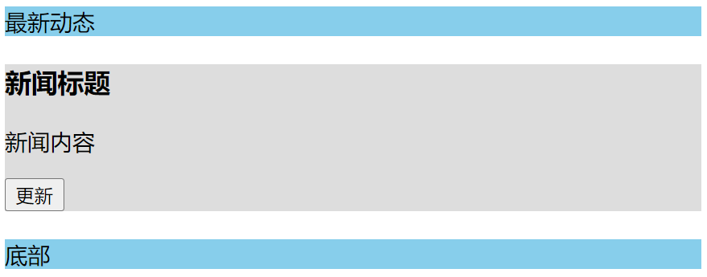
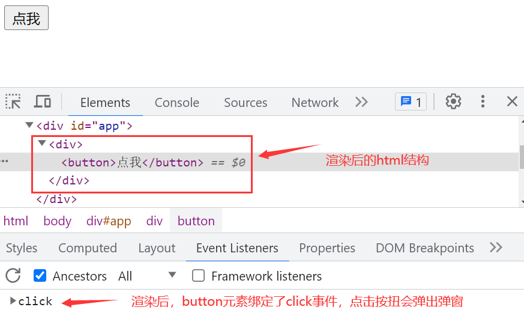
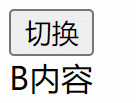
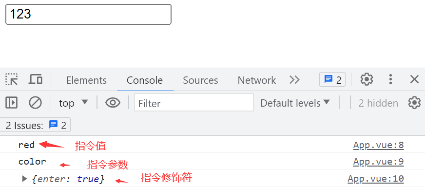
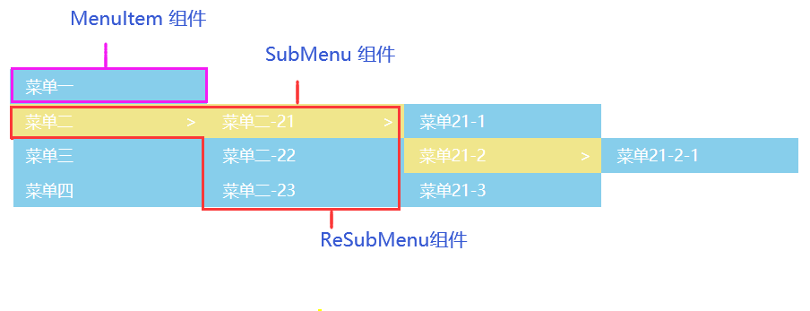
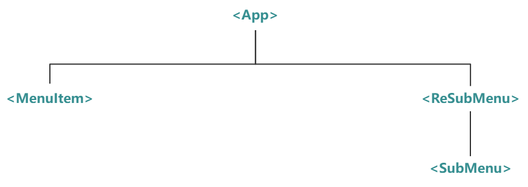

# Vue 渲染机制 - 虚拟 DOM，render、h 函数，渲染流程

Vue 是如何将一份模板转换为真实的 DOM 节点的，这就需要我们了解 Vue 的渲染机制。要了解 Vue 的渲染机制，需要我们了解以下内容：

- Vue 描述 UI 的 2 种方式
- 虚拟 DOM
- 渲染函数（h 函数、render 函数）
- vue 渲染机制
- 深入 h 函数
- 渲染函数案例

> 相关资料查阅 Vue 官方文档，[渲染函数 & JSX(opens new window)](https://cn.vuejs.org/guide/extras/render-function.html)

## 一、Vue 描述 UI 的 2 种方式

Vue 提供了以下两种方式来声明式描述 UI

- 模板语法来描述 UI
- 虚拟 DOM 来描述 UI

**模板语法**

- 以下代码使用模板语法来描述 UI

```html
<!-- 模板语法描述UI -->
<button @click="count++">{{ count }}</button>
```

**虚拟 DOM**

> 以下代码使用虚拟 DOM 来描述 UI

```js
/*
   h() 函数是Vue提供用来创建虚拟DOM ,函数的
      第一个参数：元素的HTML标签名
      第二个参数：标签元素的属性、事件等
      第三个参数：标签元素的子元素内容
*/
h('button', { onClick: () => count.value++ }, count.value)
```

注：

以上两段代码采用了不同的方式描述 UI，但最终渲染出来的结果是一模一样，都是告诉 Vue：

- 需要生成`button`元素，`button`元素的`innerText`值为`count`变量的值
- 为`button`元素绑定了`click`事件，点击按扭后，`count`变量的值 +1

## 二、虚拟 DOM

本小节我们将了解虚拟 DOM 的定义、如何手动创建虚拟 DOM、如何通过 JS 自动创建虚拟 DOM。

### 1、虚拟 DOM 定义

虚拟 DOM（Virtual DOM，简称 VDOM）是一种编程概念，意为将目标所需的 UI 通过数据结构“虚拟”地表示出来，保存在内存中，然后将真实的 DOM 与之保持同步。

> **”虚拟 DOM“** 简单理解就是用一个纯 JavaScript 的对象来描述真实的 DOM 结构

”虚拟 DOM“ 这个概念是由 React 率先开拓，随后被许多不同的框架采用，当然也包括 Vue。

以下为真实 DOM

```html
<div id="box" class="active"></div>
```

转换成虚拟 DOM

```js
const vnode = {
  // 标签名 <div>
  tag: 'div',
  // 标签上的属性
  props: {
    id: 'box',
    class: 'active',
  },
  children: null, // 可以是 null 空数组、"" 或 不存在 都可以
  // .....
}
```

注：

上面代码用一个 JS 对象表达 DOM 结构

- tag ：属性用来描述标签名称，所以`tag:'div'` 描述的就是一个`<div>`标签
- props：属性值是一个对象，用来描述标签的属性、事件等内容。所以`props:{id:'box',class:'active'}` 表示标签的属性，如：`<div id='box' class='active'></div>`
- children：属性用来描述标签的子节点，没有子节点，所以值为 null，当然也可是空数组，空字符串都可以。

**注意：** JS 对象表示 vnode 的写法并不是固定的，对象中属性名可以自定义，也可以增加其它属性来表示元素的其它信息，没有规定说一定要如何写才是对，只要能用一个对象来表达出 DOM 的信息，就是合理的。

> 与其说虚拟 DOM 是一种具体的技术，不如说是一种模式，所以并没有一个标准的实现。

### 2、手动创建虚拟 DOM

- 将以下 DOM 结构转换为虚拟 DOM（vnode）

```html
<div id="box" class="active">
  <a href="xxx.html" target="_blank">
    
  </a>
  <p>图片描述</p>
</div>
```

- 以上 DOM 结构转换为 vnode 如下

```js
const vnode = {
  // 标签名 <div>
  tag: 'div',
  // 标签上的属性
  props: {
    id: 'box',
    class: 'active',
  },
  // 标签的子节点，数组中每一个对象用来描述一个子节点
  children: [
    // 第一个子节点，
    {
      tag: 'a',
      props: {
        href: 'xxx.html',
        target: '_blank',
      },
      children: [
        {
          tag: 'img',
          props: {
            src: 'xxx.png',
            alt: '图片',
          },
        },
      ],
    },
    // 第二个子节点
    {
      tag: 'p',
      children: '图片描述',
    },
  ],
}
```

注：

上面代码用一个 JS 对象表达 DOM 结构

- tag ：属性用来描述标签名称，所以`tag:'div'` 描述的就是一个`<div>`标签
- props：属性值是一个对象，用来描述标签的属性、事件等内容。所以`props:{id:'box',class:'active'}` 表示标签的属性，如：`<div id='box' class='active'></div>`
- children：属性用来描述标签的子节点
  - 值可以是一个数组，数组中的每一个对象表示一个子节点。
  - 也可以是一个字符串，表示只有一个文本类的子节点。

### 3、自动创建虚拟 DOM

如果真实 DOM 的结构非常复杂，我们还采用手动形式来书写虚拟 DOM 这肯定是不可行的。所以我们可以创建一个方法，用来将真实 DOM 转换成虚拟 DOM

**实现原理**

- 创建一个函数，根据真实 DOM 节点返回 vnode
- 处理节点标签名
- 处理节点属性
- 处理节点的子节点

**实现步骤**

- 创建一个函数`createNode`，该函数的第一个参数为真实 DOM 元素，然后返回该 DOM 元素的 vnode

```js
function createNode(el) {
  const vnode = {}
  // ....
  return vnode
}
// 返回#box的vnode
const vnode = createNode(document.getElementById('box'))
```

- 判断 el 是否是元素节点，如果是元素节点，则获取该元素的标签名

```js
// 1、判断el是否为元素节点，如果是，获取该元素的标签名
if (el.nodeType === 1) {
  vnode.tag = el.tagName.toLowerCase()
}
```

- 获取元素节点的所有属性，然后将属性名与属性值作为 props 的属性和属性值

```js
// 2、获取元素节点的所有属性，然后将属性名与属性值作为props的属性和属性值
const attrs = el.attributes
// 如果有属性
if (attrs.length) {
  const props = {}
  vnode.props = props
  ;[...attrs].forEach((attr) => {
    // 取出对应属性的属性名与属性值
    let { name, value } = attr
    props[name] = value
  })
}
```

- 获取该元素节点的子节点，如果存在，创建`vnode.children=[]`,用来保存子节点。
- 在添加前，要判断子节点的类型。
  - 如果子节点为文本节点，则直接将文本节点的 nodeValue 添加到数组中
  - 如果子节点为元素节点，则利用递归，获取子节点的 vnode，然后将 vnode 添加到数组中。

```js
// 3、获取子节点
const children = el.childNodes
// 如果存在子节点
if (children.length) {
  vnode.children = []
  ;[...children].forEach((child) => {
    // 如果为文本节点
    if (child.nodeType === 3) {
      // 如果不考虑空的文本节点，可以加个判断
      if (child.nodeValue.trim()) {
        vnode.children.push(child.nodeValue.trim())
      }
      // 如果为元素节点
    } else if (child.nodeType === 1) {
      vnode.children.push(createNode(child))
    }
  })
}
```

> 最终完整版代码如下：

```js
export default function createNode(el) {
  const vnode = {}

  // 1、判断el是否为元素节点，如果是，获取该元素的标签名
  if (el.nodeType === 1) {
    vnode.tag = el.tagName.toLowerCase()

    // 2、获取元素的所有属性，然后遍历，将属性与属性对应值添加到props对象上
    const attrs = el.attributes
    // 如果有属性
    if (attrs.length) {
      const props = {}
      vnode.props = props
      ;[...attrs].forEach((attr) => {
        let { name, value } = attr
        props[name] = value
      })
    }
    // 3、获取子节点
    const children = el.childNodes
    // 如果存在子节点
    if (children.length) {
      vnode.children = []
      ;[...children].forEach((child) => {
        // 如果为文本节点
        if (child.nodeType === 3) {
          // 如果不考虑空的文本节点，可以加个判断
          if (child.nodeValue.trim()) {
            vnode.children.push(child.nodeValue.trim())
          }
          // 如果为元素节点
        } else if (child.nodeType === 1) {
          vnode.children.push(createNode(child))
        }
      })
    }
  }

  // ....
  return vnode
}
```

代码测试示例

```html
<div id="box" class="active">
  <a href="xxx.html" target="_blank">
    
  </a>
  <p>图片描述</p>
  文本节点内容
</div>

<script>
  const vnode = createNode(document.getElementById('box'))
  console.log(vnode)
</script>
```

最终生成如下虚拟 DOM

```json
{
  "tag": "div",
  "props": {
    "id": "box",
    "class": "active"
  },
  "children": [
    {
      "tag": "a",
      "props": {
        "href": "xxx.html",
        "target": "_blank"
      },
      "children": [
        {
          "tag": "img",
          "props": {
            "src": "xxx.png",
            "alt": "图片"
          }
        }
      ]
    },
    {
      "tag": "p",
      "children": ["图片描述"]
    },
    "文本节点内容"
  ]
}
```

## 三、Vue 渲染函数

前面我们提到 Vue 提供了 **模板语法** 与 **虚拟 DOM** 两种方式来声明式的描述 UI，那 Vue 是如何将模板与虚拟 DOM 转换为真实的 DOM 节点呢 ？这就需要用到 Vue 提供的以下两个函数：

- `h()`函数：创建虚拟 DOM
- `render()`渲染函数：返回虚拟 DOM

**代码示例**

以下 Vue 代码利用`h()`函数来创建虚拟 DOM，然后利用`render`渲染函数返回虚拟 DOM。最终 Vue 会利用**渲染器**将虚拟 DOM 转换为真实 DOM 显示在页面中。

```html
<script>
  import { h, ref } from 'vue'
  export default {
    setup() {
      let count = ref(10)
      /*
             	h() 函数用来创建虚拟DOM ,函数的
                第一个参数：元素的HTML标签名
                第二个参数：标签元素的属性、事件等
                第三个参数：标签元素的子元素内容
                setup函数返回值为 render渲染函数  render函数返回用虚拟DOM树，最终Vue渲染器会将虚拟DOM渲染成真实DOM挂载到页面中。
			*/
      return () => h('button', { onClick: () => count.value++ }, count.value)
    },
  }
</script>
```

> 最终渲染效果如下，点击按扭后，数字会自动加 1

![GIF2023-7-1115-43-22]()

### 1、h() 函数的语法

- Vue 提供的`h()`函数是用创建 vnodes
- `h()` 是 **hyperscript** 的简称 —— 意思是 “能生成 HTML（超文本标记语言）的 JavaScript”

**语法**

```js
function h(
 type: string | Component,
 props?: object | null,
 children?: Children | Slot | Slots
): VNode

// children值的三种类型
type Children = string | number | boolean | VNode | null | Children[]
type Slot = () => Children  // 组件默认插槽内容
type Slots = { [name: string]: Slot }  //  组件插槽内容
```

参数

- type：如果值为字符串，表示生成 DOM 元素的标签名。如果是一个 Vue 组件，表示将组件转换为 vnode
- props ：可选参数，用于定义生成后标签元素或组件的属性、事件，值可以是一个对象也可以 null
- children：可选参数，用于生成标签元素的子节点或组件的插槽内容

### 2、h 函数的基本用法

实际上`h()`函数的使用非常灵活。`h`函数可以

- 创建原生 HTML 元素的 vnode
- 也可以创建组件的 vnode

### 2.1、创建 HTML 元素的 vnode

以下代码为测试示例，你可以更改以下代码的`h()`，来查看最终生成的 DOM，掌握`h`函数的用法

```html
<script>
  import { h } from 'vue'
  export default {
    setup() {
      return () => h('div')
    },
  }
</script>
```

- h 函数被传入三个参数，第一个参数为标签名，第二个为标签属性，第三个为子节点

```js
h('div', { id: 'box' }, 'Hello Vue!!')

// 以上代码，最终生成如下结构的vnode
const vndoe = {
  type: 'div',
  props: { id: 'box' },
  children: 'Hello Vue!!',
  //......
}
//  渲染后DOM :   <div id='box'> Hello Vue!! </div>
```

- 第一个参数必填，表示标签名，其它两个参数为可选项

```js
h('div') // 渲染后DOM : <div></div>
h('div', { id: 'foo' }) // 渲染后DOM :<div id='foo'></div>
```

- 没有 prop 时可以省略不写，第二个参数表示子节点

```js
h('div', 'hello') //  渲染后DOM :<div>hello</div>
h('div', [h('span', 'hello')]) // 渲染后DOM : <div><span>hello</span></div>
```

- 第三个参数`children`，可以是是以下任意类型

```js
/* 字符串、数字、布尔值、虚拟DOM、null 、数组（成员为前面几种类型组成） */
type Children = string | number | boolean | VNode | null | Children[]
h('div', { id: 'foo' }, 'hello')
// 渲染后DOM :<div id="foo">hello</div>

h('div', true)
//  渲染后DOM:<div>true</div>

h('div', h('span', { class: 'sp' }))
// 渲染后DOM <div><span class="sp"></span></div>

h('div', ['hello', h('span', 'hello')])
// 渲染后DOM : <div>hello<span>hello</span></div>
```

### 2.2、创建组件的 vnode

当给组件创建 vnode 时，传入给`h()`函数的

- 第一个参数应当是组件的定义
- 第二个参数是传递给组件的 prop 或 事件监听
- 第三个参数是传递给组件的插槽内容，如果组件只有默认槽，可以使用单个插槽函数进行传递。否则，必须以插槽函数的对象形式来传递。

```js
type Slot = () => Children // 只有一个默认插槽时，通过插槽函数传递插槽内容
type Slots = { [name: string]: Slot } // 多个插槽时，要通过插槽函数对象形式传递插槽内容
```

**代码示例**

- `App.vue`

```html
<script>
  import { h, ref } from 'vue';
  import A from "./components/A.vue"

  export default {
      setup() {
          const title = ref("新闻标题");
          const info = ref("新闻内容");

          function update() {
              title.value = "标题XXX";
              info.value = "内容XXX"

          // 渲染函数
          return () => h(
              // 组件定义
              A,
              // 组件属性与事件
              {
                  title: title.value,  // prop属性
                  info: info.value,  //  prop属性
                  onUpdate: update  // 组件监听事件
              },
              // 只传递默认插槽内容
              // () => h('div', { class: "header" }, "最新动态"),
              // 传递多个插槽内容
              {
                  default: () => h('div', { class: "header" }, "最新动态"),
                  footer: () => h('div', { class: 'footer' }, "底部")
              }
          )
      }
  }
</script>

<style scoped>
  .header,
  .footer {
    margin: 20px 0;
    background-color: skyblue;
  }
</style>
```

- `A.vue`

```html
<script setup>
  // props
  defineProps(['title', 'info'])
  // emit
  defineEmits(['update'])
</script>

<template>
  <div class="com-a">
    <!-- 默认插槽 -->
    <slot></slot>

    <div class="main">
      <h3>{{ title }}</h3>
      <p>{{ info }}</p>
      <button @click="$emit('update')">更新</button>
    </div>

    <!-- 具名插槽 -->
    <slot name="footer"></slot>
  </div>
</template>

<style scoped>
  .main {
    background-color: #ddd;
  }
</style>
```

> 以上示例最终渲染效果如下：



### 3、渲染函数的基本用法

`render()`用于编程式地创建组件虚拟 DOM 树的函数，返回值为 VNodeChild 类型。

> 在以下三种情况会用到渲染函数

- 选项式 API 中的 render 选项
- `setup()`函数直接返回 render 渲染函数
- `<script setup>`中使用 render 渲染函数

### 3.1、选项式 API

- 在选项式 API 中，我们可以使用 `render` 选项来声明渲染函数
- `render()`函数中的 this 为当前组件实例，所以在`render()`函数中可以访问组件的属性和方法等

```html
<!-- App.vue -->
<script>
  import { h } from 'vue'
  export default {
    data() {
      return {
        message: 'Hello Vue!!',
      }
    },
    render() {
      // 返回值为vnode
      return h('div', { id: 'box' }, this.message)
    },
  }
</script>
```

> 以上 App 组件最终渲染后的真实 DOM 如下：

```html
<div id="box">Hello Vue!!</div>
```

### 3.2、setup() 函数中

- 组合式 API 中，`setup()`钩子可以直接返回渲染函数。
- 在 `setup()` 内部声明的渲染函数天生能够访问在同一范围内声明的 props 和许多响应式状态。

```html
<script>
  import { h, ref } from 'vue'
  export default {
    props: ['text'], // props.text的值是 Vue!!
    data() {
      return {
        message: 'Hello', // setup中访问不到
      }
    },
    setup(props) {
      const msg = ref('Hello')
      return () => {
        return h('div', { id: 'box' }, msg.value + props.text)
      }
    },
  }
</script>
```

> 以上 App 组件最终渲染后的真实 DOM 如下：

```html
<div id="box">Hello Vue!!</div>
```

### 3.3、在 `<script setup>` 中使用

在 setup 中，一个带有 render 选项的 JS 对象就会被当成组件渲染，可以直接在模板中使用。

```html
<script setup>
  import { h, ref } from 'vue'
  const info = ref('ComA')
  const ComA = {
    render() {
      return h('div', info.value)
    },
  }
</script>

<template>
  <ComA></ComA>
</template>
```

### 4、根渲染函数

根渲染函数是用将一个 vnode 转换为真实 DOM 挂载到指定的 DOM 容器中。

**语法：**

```js
function render(vnode, container, isSVG?: boolean) {}
```

**代码示例**

```html
<script setup>
  import { h, render, ref, onMounted } from 'vue'
  // 创建vnode
  const vnode = h('div', { id: 'box' }, 'Hello Vue!!')
  // 获取.container元素
  const container = ref(null)
  onMounted(() => {
    // 将vnode转换为真实DOM挂载到页面
    // 第一个参数为vnode，第二个参数为挂载容器
    render(vnode, container.value)
    // render(vnode, document.body)
  })
</script>
<template>
  <div class="container" ref="container"></div>
</template>
```

### 5、渲染函数 与 template 模板

- `render`函数是字符串模板的一种替代，所以不能一个组件中同时拥有`render`和`template`。
- 因为单文件组件中的`template`模板，会在构建时被编译为`render`函数，添加到组件实例上。

**代码示例**

- `A.vue`文件

```html
<script setup>
  import { ref } from 'vue'
  const msg = ref('A组件')
</script>
<template>
  <div>A组件</div>
</template>
```

- `App.vue`

```html
<script setup>
  import A from './components/A.vue'
  console.log(A)
</script>
<template></template>
```

> 最终在控制台打印出的 A 是一个带有 render 选项的 JS 对象


### 6、模板 VS 渲染函数

Vue 提供了以下两种方式来声明式描述 UI

- 使用模板语法来描述 UI
- 使用虚拟 DOM 来描述 UI

> 在绝大多数情况下，Vue 推荐使用模板语法来创建应用，主要原因有：

- 模板更贴近实际的 HTML。这使得我们能够更方便地重用一些已有的 HTML 代码片段，能够带来更好的可访问性体验、能更方便地使用 CSS 应用样式，并且更容易使设计师理解和修改。
- 由于其确定的语法，更容易对模板做静态分析。这使得 Vue 的模板编译器能够应用许多编译时优化来提升虚拟 DOM 的性能表现 。具体内容参考 Vue 官网：[带编译时信息的虚拟 DOM(opens new window)](https://cn.vuejs.org/guide/extras/rendering-mechanism.html#compiler-informed-virtual-dom)

在实践中，模板对大多数的应用场景都是够用且高效的。渲染函数一般只会在需要处理高度动态渲染逻辑的可重用组件中使用。

> 比如接下来要讲到的《动态生成带锚点标题》的案例，使用渲染函数要比使用模板语法来的更简洁高效易读。

### 7、实战应用：动态生成带锚点标题

我们希望创建如下这样一个组件，这个组件可以根据传入的`level`属性值，动态生成带有链接的的 h 标签。

```html
<AnchoredHeading :level="3" href="http://www.icodingedu.com">艾编程</AnchoredHeading>

<!-- 以上代码最终编译后的真实DOM如下 -->
<h3><a href="http://www.icodingedu.com">艾编程</a></h3>
```

> 我们采用模板语法和虚拟 DOM 两种方式来描述 UI，通过对比来看那种方式更简洁

- 模板语法来描述 UI

```html
<script setup>
  defineProps(['level', 'href'])
</script>
<template>
  <h1 v-if="level === 1">
    <a :href="href">
      <slot></slot>
    </a>
  </h1>
  <h2 v-else-if="level === 2">
    <a :href="href">
      <slot></slot>
    </a>
  </h2>
  <h3 v-else-if="level === 3">
    <a :href="href">
      <slot></slot>
    </a>
  </h3>
  <h4 v-else-if="level === 4">
    <a :href="href">
      <slot></slot>
    </a>
  </h4>
  <h5 v-else-if="level === 5">
    <a :href="href">
      <slot></slot>
    </a>
  </h5>
  <h6 v-else-if="level === 6">
    <a :href="href">
      <slot></slot>
    </a>
  </h6>
</template>
```

- 虚拟 DOM 描述 UI

```html
<script>
  import { h } from 'vue'
  export default {
    props: ['level', 'href'],
    setup(props, { slots }) {
      return () => h('h' + props.level, h('a', { href: props.href }, slots.default()))
    },
  }
</script>
```

> 通过对比，明显采用虚拟 DOM 描述 UI 的方式在这里更合适，代码相对要简洁很多。

## 四、Vue 渲染机制

通过前面的学习，我知道 Vue 提供了**模板语法** 与 **虚拟 DOM**两种方式声明式描述 UI。

如果 Vue 提供虚拟 DOM 来描述 UI，则需要用到 h 函数来创建虚拟 DOM，render 函数来返回虚拟 DOM。最终 vue 渲染器会将 vnode 转换为真实 DOM。**但渲染器是如何将 vnode 转换为真实 DOM 的呢 ？**

如果 Vue 采用模板语法来描述 UI，**那模板最终会被编译成什么，又如何转换成真实 DOM 的呢？**

> 要回答面提到的两个问题，就需要先掌握以下几个知识点：

- 编译器
- 虚拟 DOM
- 渲染器
- 渲染器渲染组件

当我们了解了以上知识点后，我们就知道 Vue 的整个渲染流程和渲染机制了。

### 1、编译器

Vue 中的编译器主要是将 Vue 的模板编译成渲染函数，该渲染函数会添加到组件实例上。这一步通常是通过构建步骤提前完成的，也可以使用运行时编译器即时完成。即：

- 如果我们采用虚拟 DOM 来描述 UI，并不需要用到编译器，因为我们是直接通过`h()`函数来创建 vnode，然后在`render`渲染函数中返回 vnode。
- 只有采用模板语法来描述 UI 时，才需要用到编译器。

> 定义了一个 Vue 组件：

```html
<!--A组件-->
<script setup>
  function handler() {}
</script>
<template>
  <div @click="handler">点我</div>
</template>
```

在构建时，编译器会将上模板转换为一个与之功能相同的渲染函数，添加到组件实例上。

> 以上单文件组件最终被转换成如下代码：

```js
function handler() {}
const A = {
  __name: 'A', // 组件名
  render() {
    //  h函数，用来生成vnode，
    return h('div', { onClick: handler }, '点我')
  },
  //	......省略更多属性
}
```

### 2、渲染器

通过前面的学习我知道，如果 Vue 项目采用的是模板语法来描述 UI，则在构建项目时首先会利用编译器将模板编译成`render`渲染函数，渲染函数的返回值为虚拟 DOM。

那 Vue 是如何将一个虚拟 DOM 转换为一个真实的 DOM 并渲染到浏览器页面中呢 ？这就需要借助渲染器来实现。

> 渲染器的作用就是把虚拟 DOM 渲染为真实 DOM


**代码示例**

> 将以下 vnode 渲染成一个真实的 DOM

```js
// 虚拟DOM中需要用到的事件处理函数
function handler() {
  alert('我被点击了')
}
// vnode为虚拟DOM
const vnode = {
  // html元素标签名
  tag: 'div',
  // 元素身上的属性
  props: {
    id: 'box',
  },
  // 元素子节点
  children: [
    {
      tag: 'button',
      props: {
        onClick: handler, // 绑定一个click事件，事件处理函数为handler
      },
      children: '点我',
    },
  ],
}
```

> 编写一个渲染器，将上面虚拟 DOM 转换为真实 DOM

实现思路：

- **创建 html 元素**：把 `vnode.tag` 作为标签名来创建 DOM 元素
- **为元素添加属性和事件**：遍历`vnode.props`对象，如果 key 以 on 字符开头，说明它是一个事件，事件名为`on`之后的字符，则从`on`之后截图字符并利用`toLowerCase`函数将事件名转换为小写，最终得到合法的事件名称。如：`onClick`变成`click`，最后调用`addEventListener`方法为元素添加事件监听。
- **创建子节点**：首先判断 children 是否有内容，如果没有则不做任何处理，如果是一个字符串，则使用`createTextNode`方法创建一个文本节点，并将其加入到新创建的元素内。如果是一个数组，则遍历数组，然后递归`renderer`函数继续渲染子节点。
- **挂载**：将`vnode.tag`作为标签名创建的元素挂载到真实的 DOM 容器`container`中

**完整版代码**

```js
/**
 * 创建渲染器 renderer
 * vnode为需要渲染的虚拟DOM
 * container为一个真实DOM，渲染后的DOM需要挂载的容器
 */
function renderer(vnode, container) {
  // 获取tag属性，创建DOM元素
  const el = document.createElement(vnode.tag)
  // 遍历props，将属性与事件添加到元素身上
  for (const key in vnode.props) {
    // 如果key为on开头，表示添加的事件
    if (/^on/.test(key)) {
      // 将事件名，转换为小写，并去掉on
      const eventName = key.substring(2).toLocaleLowerCase()
      // 添加事件监听
      window.addEventListener(eventName, vnode.props[key])
    } else {
      el.setAttribute(key, vnode.props[key])
    }
  }
  // 判断是否有子节点,并判断是一个子节点还是多个，
  // 如果是一个，则是一个字符串，如果是多个，则是一个数组
  if (vnode.children && typeof vnode.children === 'string') {
    // 创建文本类子节点
    el.appendChild(document.createTextNode(vnode.children))
  } else if (Array.isArray(vnode.children)) {
    // 如果有多个子节点，则利用递归来处理
    vnode.children.forEach((child) => {
      renderer(child, el)
    })
  }
  // 将元素添加到挂载容器中
  container.appendChild(el)
}
```

> 以上 renderer 函数最终将 vnode 转换为一个真实 DOM 并渲染到页面中，具体效果如下：



温馨提示：

我们上们只学习了渲染器如何在初始化时创建 DOM 节点，但渲染器的核心是 DOM 的更新，DOM 的更新涉及到 diff 算法与响应式，非常复杂，目前暂时不讲解。

### 3、渲染器渲染组件

> 通过前面的学习我们知道

组件最终编译成一个带有 render 函数的对象。render 函数返回值是一组 vnode，这里的 vnode 就是`template`模板中的内容被编译器编译成了虚拟 DOM。

> 以下代码为编译后的组件实例

```js
// A组件实例
const A = {
  render() {
    //  h函数，用来生成vnode，
    return h('div', { onClick: handler }, '点我')
  },
  //	......省略更多属性
}
```

- 虚拟 DOM 是用一个纯 JavaScript 的对象来描述真实的 DOM 结构。其实虚拟 DOM 除了能描述真实 DOM 之外，还能够描述组件。只需要将 vnode 对象的 tag 属性定义为一个组件的定义就 ok。

> 以下为组件 A 的虚拟 DOM

```js
const vnode={
	tag：A  // A为组件实例
}
```

- **渲染器的作用就是把虚拟 DOM 渲染成一个真实 DOM**。那渲染器在渲染时，他如何判断是要渲染一个 HTML 元素，还是渲染一个组件呢？

> 渲染器在渲染时会判断传入的第一个参数 vnode 的 tag 属性值是一个字符串还是一个对象

- 如果是一个字符串则会渲染成 HTML 元素
- 如果是一个对象，则调用该对象的`render`方法得到`vnode`，然后递归调用用`renderer`渲染器来渲染 vnode。

> 为了使渲染器能渲染组件，我们需要对`renderer`函数做修改，具体如下：

```js
function renderer(vnode, container) {
  // 如果tag的值为字符串，则vnode描述的是标签元素
  if (typeof vnode.tag === 'string') {
    // mountElement方法，就是原来的renderer方法
    mountElement(vnode, container)
    // 如果tag的值为对象，则vnode描述的是组件
  } else if (typeof vnode.tag === 'object') {
    mountComponent(vnode, container)
  }
}
```

- mountElement 函数用来渲染标签元素，与前面提到的 renderer 函数内容一致。

```js
/**
 * 创建渲染器
 * vnode为需要渲染的虚拟DOM
 * container为一个真实DOM，渲染后的DOM需要挂载的容器
 */
function mountElement(vnode, container) {
  // 获取tag属性，创建DOM元素
  const el = document.createElement(vnode.tag)
  // 遍历props，将属性与事件添加到元素身上
  for (const key in vnode.props) {
    // 如果key为on开头，表示添加的事件
    if (/^on/.test(key)) {
      // 将事件名，转换为小写，并去掉on
      const eventName = key.substring(2).toLocaleLowerCase()
      // 添加事件监听
      window.addEventListener(eventName, vnode.props[key])
    } else {
      el.setAttribute(key, vnode.props[key])
    }
  }
  // 判断是否有子节点,并判断是一个子节点还是多个，
  // 如果是一个，则是一个字符串，如果是多个，则是一个数组
  if (vnode.children && typeof vnode.children === 'string') {
    // 创建文本类子节点
    el.appendChild(document.createTextNode(vnode.children))
  } else if (Array.isArray(vnode.children)) {
    // 如果有多个子节点，则利用递归来处理
    vnode.children.forEach((child) => {
      renderer(child, el)
    })
  }
  // 将元素添加到挂载容器中
  container.appendChild(el)
}
```

- mountComponent 函数，用来渲染组件。内容如下：

```js
function mountComponent(vnode, container) {
  // vnode.tag是组件对象，调用它的render函数得到组件要渲染的内容(vnode)
  const subtree = vnode.tag.render()
  mountElement(subtree, container)
}
```

**测试代码**

```js
// A组件实例
const A = {
  render() {
    return {
      tag: 'div',
      props: {
        id: 'com',
      },
      children: [
        {
          tag: 'p',
          children: '组件内容',
        },
      ],
    }
  },
}

// DOM元素的虚拟DOM
const vnode1 = {
  tag: 'div',
  props: {
    class: 'box1',
  },
  children: 'div元素',
}

// 组件A的虚拟DOM
const vnode2 = {
  tag: A,
}
// 渲染 html元素，挂载到#app容器中
renderer(vnode1, document.getElementById('app'))
// 渲染组件，最终将生成的html元素挂载到#app2容器中
renderer(vnode2, document.getElementById('app2'))
```

> 最终渲染后代码如下：

```html
<div id="app">
  <div class="box1">div元素</div>
</div>

<div id="app2">
  <div id="com">
    <p>组件内容</p>
  </div>
</div>
```

### 4、Vue 渲染流程

> 通过前面的学习，我们知道了 Vue 的渲染流程大致如下图：


编译

在项目构建阶段，会通过编译器将 Vue 模板编译为**渲染函数**，渲染函数用来返回虚拟 DOM 树

**挂载（渲染器）**

在运行项目时，渲染器会调用组件身上的渲染函数，遍历返回的虚拟 DOM 树，并基于它创建实际的 DOM 节点。当然内部还会做相关的响应式处理等更多优化。

**更新**

当某个响应式数据发生是变化时，会创建一个更新后的虚拟 DOM 树，然后渲染器遍历这棵新树，将它与旧树进行比较，然后将必要的更新应用到真实 DOM 上去。

## 五、深入 h 函数

前端我们对`h`函数的用法做了一定的了解，接下来我们针对没有讲到的一些内容做相关补充

- attribute 和 property 都可以用于 prop，Vue 会自动选择正确的方式来分配它

```js
h('div', { class: 'bar', innerHTML: 'hello' })
// 渲染后DOM : <div class="bar">hello</div>
```

- class 与 style 可以像在模板中一样，用数组或对象的形式书写

```html
<script>
  import { h, ref } from 'vue'
  export default {
    setup() {
      const foo = ref('foo')
      const bar = ref(true)
      return () => h('div', { class: [foo.value, { bar }], style: { color: 'red' } })
    },
  }
</script>

<!-- 渲染后DOM如下-->
<div class="foo bar" style="color: red;"></div>
```

- 给元素添加事件监听器以`onxxx`的形式书写

```js
h(
  'div',
  {
    onClick: () => {
      alert('点击了')
    },
  },
  '点我',
)
// 渲染后DOM : <div>点我</div>
// 元素添加了点击事件，点击元素时，会弹出弹窗，显示"点击了"
```

### 1、vnodes 必须唯一

组件树中的 vnodes 必须是唯 一的，以下为错误示范:

```html
<script>
  import { h } from 'vue'
  const p = h('p', 'hi')

  export default {
    setup() {
      return () => h('div', [p, p])
    },
  }
</script>
```

如果 vnodes 是一样的，那后期操作 DOM 时，操作第一个 p 会影响到第二个 p

如果你真的非常想在页面上渲染多个重复的元素或者组件，你可以使用一个工厂函数来做这件事。

> 以下代码可以渲染出 10 个一样的 p 标签

```html
<script>
  import { h } from 'vue'
  export default {
    setup() {
      return () =>
        h(
          'div',
          Array.from({ length: 20 }).map(() => h('p', 'h1')),
        )
    },
  }
</script>
```

## 六、渲染函数案例

本小节我们来利用渲染函数实现与模板语法相同的功能。如：利用渲染函数实现

- v-on 事件
- v-if 指令
- v-for 指令
- 事件修饰符
- 动态组件
- 内置组件
- 渲染插槽
- 传递插槽
- 组件 v-model
- 自定义指令
- 模板引用

### 1、v-on 事件

> 模板描述 UI

```html
<script setup>
  import { ref } from 'vue'
  const count = ref(0)
</script>
<template>
  <button @click="count++">{{ count }}</button>
</template>
```

> 上面代码等价于下面代码

```html
<script>
  import { h, ref } from 'vue'
  export default {
    setup() {
      const count = ref(0)
      return () => h('button', { onClick: () => count.value++ }, count.value)
    },
  }
</script>
```

### 2、v-if 指令

> 模板描述 UI

```html
<script setup>
  import { ref } from 'vue'
  const isShow = ref(true)
</script>
<template>
  <!--模板语法-->
  <div>
    <button @click="isShow = !isShow">切换</button>
    <div v-if="isShow">A内容</div>
    <div v-else>B内容</div>
  </div>
</template>
```

> 上面代码等价于下面代码

```html
<script>
  import { h, ref } from 'vue'
  export default {
    setup() {
      const isShow = ref(true)
      // 渲染函数--------------
      return () =>
        h('div', [
          h('button', { onClick: () => (isShow.value = !isShow.value) }, '切换'),
          isShow.value ? h('div', 'A内容') : h('div', ' B内容'),
        ])
    },
  }
</script>
```

> 最终渲染效果如下：



### 3、v-for

> 模板描述 UI

```html
<script setup>
  import { reactive } from 'vue'
  const list = reactive([1, 2, 3])
</script>

<template>
  <ul>
    <li v-for="(item, index) in list" :key="index">{{ item }}</li>
  </ul>
</template>
```

> 上面代码等价于下面代码

```html
<script>
  import { h, reactive } from 'vue'
  export default {
    setup() {
      const list = reactive([1, 2, 3])
      return () =>
        h(
          'ul',
          list.map((item, index) => h('li', { key: index }, item)),
        )
    },
  }
</script>
```

> 最终渲染效果如下：

![image-20230711225148172]()

### 4、事件修饰符

- 对于 `.passive`、`.capture` 和 `.once` 事件修饰符，可以使用驼峰写法将他们拼接在事件名后面：

> 模板描述 UI

```html
<script setup>
  import { ref } from 'vue'
  const count = ref(1)
</script>
<template>
  <!--只能点击一次，按下enter抬起键盘背景变红色-->
  <button @click.once="count++">{{ count }}</button>
</template>
```

> 上面代码等价于下面代码

```html
<script>
  import { h, ref } from 'vue'
  export default {
    setup() {
      const count = ref(0)
      return () =>
        h(
          'button',
          {
            onClickOnce: () => count.value++,
          },
          count.value,
        )
    },
  }
</script>
```

- 对于事件和按键修饰符，可以使用 [`withModifiers` (opens new window)](https://cn.vuejs.org/api/render-function.html#withmodifiers)函数：

> 模板描述 UI

```html
<script setup>
  import { h, ref } from 'vue'
  const count = ref(0)
</script>
<template>
  <div @click.self="count++">
    <span>{{ count }}</span>
  </div>
</template>
<style scoped>
  div {
    width: 50px;
    height: 50px;
    padding: 50px;
    background-color: skyblue;
  }

  div span {
    display: block;
    width: 50px;
    height: 50px;
    background-color: khaki;
  }
</style>
```

> 上面代码等价于下面代码

```html
<script>
  import { h, ref, withModifiers } from 'vue'
  export default {
    setup() {
      const count = ref(0)
      return () =>
        h(
          'div',
          {
            onClick: withModifiers(() => count.value++, ['self']),
          },
          [h('span', count.value)],
        )
    },
  }
</script>
<style scoped>
  div {
    width: 50px;
    height: 50px;
    padding: 50px;
    background-color: skyblue;
  }

  div span {
    display: block;
    width: 50px;
    height: 50px;
    background-color: khaki;
  }
</style>
```

### 5、组件

> 模板描述 UI

```html
<script setup>
  import { shallowRef } from 'vue'
  import A from './components/A.vue'
  import B from './components/B.vue'
  const current = shallowRef(A)
</script>
<template>
  <button @click="current = B">切换到B</button>
  <component :is="current"></component>
</template>
```

> 上面代码等价于下面代码

```html
<script>
  import { h, shallowRef } from 'vue'
  import A from './components/A.vue'
  import B from './components/B.vue'

  export default {
    setup() {
      const current = shallowRef(A)
      return () =>
        h('div', [
          h('button', { onClick: () => (current.value = B) }, '切换到B'),
          // 渲染组件的虚拟DOM
          h(current.value),
        ])
    },
  }
</script>
```

> 最终渲染效果如下：


### 6、内置组件

诸如 `<KeepAlive>`、`<Transition>`、`<TransitionGroup>`、`<Teleport>` 和 `<Suspense>` 等[内置组件 (opens new window)](https://cn.vuejs.org/api/built-in-components.html)在渲染函数中必须导入才能使用：

> 模板描述 UI

```html
<script setup>
  import { h, shallowRef } from 'vue'
  import A from './components/A.vue'
  import B from './components/B.vue'
  const current = shallowRef(A)
</script>
<template>
  <button @click="current = B">切换到B</button>
  <button @click="current = A">切换到A</button>
  <KeepAlive>
    <component :is="current"></component>
  </KeepAlive>
</template>
```

> 上面代码等价于下面代码

```html
<script>
  import { h, shallowRef, resolveComponent, KeepAlive } from 'vue'
  import A from './components/A.vue'
  import B from './components/B.vue'

  export default {
    setup() {
      const current = shallowRef(A)
      return () =>
        h('div', [
          h('button', { onClick: () => (current.value = B) }, '切换到B'),
          h('button', { onClick: () => (current.value = A) }, '切换到A'),
          h(KeepAlive, [h(current.value)]),
        ])
    },
  }
</script>
```

> 最终渲染效果如下：


### 7、渲染插槽

在渲染函数中，插槽可以通过 `setup()` 的上下文来访问。

每个 `slots` 对象中的插槽都是一个**返回 vnodes 数组的函数**：

> 模板描述 UI

```html
<template>
  <div>
    <!-- 具名插槽 -->
    <slot name="header"></slot>
    <!-- 默认插槽 -->
    <slot :info="{ a: 1}"></slot>
    <!-- 具名插槽 -->
    <slot name="footer"></slot>
  </div>
</template>
```

> 上面代码等价于下面代码

```html
<!--A组件-->
<script>
  import { h } from 'vue'
  export default {
    // slots用来接受传递的插槽内容，返回该插槽的vnodes数组
    setup(props, { slots }) {
      return () =>
        h('div', [
          // <slot name="header"></slot>
          slots.header(),
          // <slot info={a:1}></slot>
          slots.default({
            info: { a: 1 },
          }),
          // <slot name="footer"></slot>
          slots.footer(),
        ])
    },
  }
</script>
```

> 在组件中使用上面的 A 组件

```html
<script setup>
  import A from './components/A.vue'
</script>
<template>
  <a>
    <template #header>
      <div class="header">头部</div>
    </template>

    <template #default="{ info }">
      <div class="main">主体参数：{{ info.a }}</div>
    </template>

    <template #footer>
      <div class="footer">底部</div>
    </template>
  </a>
</template>
```

> 最终渲染效果如下：

![image-20230712161207112]()

### 8、传递插槽内容

在使用组件时，需要传递插槽内容，前面创建组件的 vnode 时讲过，可以参考：**深入 h 函数 - 创建组件的 vnode**

### 9、组件 v-model

当我们在使用 A 组件时，在组件上绑定 v-model 指令，如下：

```html
<script setup>
  import { ref } from 'vue'
  import A from './components/A.vue'
  const isShow = ref(true)
</script>
<template>
  <a v-model="isShow"></a>
</template>
```

> 在 A 组件中要接受传过来的 props 和 emits，并在需要的时候触发事件。

模板描述 UI

```html
<!--A组件-->
<script>
  import { h } from 'vue'
  export default {
    props: ['modelValue'],
    emits: ['update:modelValue'],
  }
</script>

<template>
  <button @click="$emit('update:modelValue', !modelValue)">切换</button>
  <div class="box" v-if="modelValue">内容</div>
</template>
```

上面代码等价于下面代码

```html
<script>
  import { h } from 'vue'
  export default {
    props: ['modelValue'],
    emits: ['update:modelValue'],
    setup(props, { emit }) {
      return () =>
        h('div', [
          h(
            'button',
            {
              onClick: () => emit('update:modelValue', !props.modelValue),
            },
            '切换',
          ),
          props.modelValue ? h('div', { class: 'box' }, '内容') : '',
        ])
    },
  }
</script>
```

### 10、自定义指令

可以使用 [`withDirectives` (opens new window)](https://cn.vuejs.org/api/render-function.html#withdirectives)将自定义指令应用于 vnode

> 模板描述 UI

```html
<script setup>
  const vFocus = (el, binding) => {
    console.log(binding.value) // 指令值
    console.log(binding.arg) // 指令参数
    console.log(binding.modifiers) // 指令修饰符
    el.focus()
  }
</script>

<template>
  <input type="text" v-focus:color.enter="'red'" value="123" />
</template>
```

> 上面代码等价于下面代码

```html
<script>
  import { h, withDirectives } from 'vue'

  export default {
    setup() {
      // 自定义指令
      const focus = (el, binding) => {
        console.log(binding.value) // 指令值
        console.log(binding.arg) // 指令参数
        console.log(binding.modifiers) // 指令修饰符
        el.focus()
      }
      return () =>
        withDirectives(
          // html元素
          h('input', { type: 'text', value: '123' }),
          // 指令
          [[focus, 'red', 'color', { enter: true }]],
        )
    },
  }
</script>
```

> 以上代码最终渲染效果如下：



### 11、模板引用

在组合式 API 中，模板引用通过将 `ref()` 本身作为一个属性传递给 vnode 来创建

> 模板描述 UI

```html
<script setup>
  import { ref, onMounted } from 'vue'
  const box = ref(null)
  onMounted(() => {
    console.log(box.value.innerText)
  })
</script>

<template>
  <div ref="box">box内容</div>
</template>
```

> 上面代码等价于下面代码

```html
<script>
  import { ref, onMounted, h } from 'vue'

  export default {
    setup() {
      const box = ref(null)
      onMounted(() => {
        console.log(box.value.innerText)
      })
      return () => h('div', { ref: box }, 'box内容')
    },
  }
</script>
```

## 七、函数式组件

函数式组件是一种定义自身没有任何状态的组件的方式。

它们很像纯函数：接收 props，返回 vnodes。函数式组件在渲染过程中不会创建组件实例（也就是说，没有 `this`），也不会触发常规的组件生命周期钩子。

函数式组件的写法与`setup()`函数类似，其返回值为 vnode，

```js
// 函数式组件 没有expose
function MyComponent(props, { slots, emit, attrs }) {
  // ...
  return h('div') // 返回vnode
}
```

大多数常规组件的配置选项在函数式组件中都不可用，除了 [`props` (opens new window)](https://cn.vuejs.org/api/options-state.html#props)和 [`emits` (opens new window)](https://cn.vuejs.org/api/options-state.html#emits)。我们可以给函数式组件添加对应的属性来声明它们：

```js
MyComponent.props = ['value']
MyComponent.emits = ['click']
```

### 1、函数式组件的基本用法

函数式组件和普通函数一样被组册和使用

- 在`<script setup>`中定义函数式组件，则在模板中可以直接使用

```html
<script setup>
  import { h } from 'vue'
  function MyComponent(props, { slots, emit, attrs }) {
    // ...
    return h('div', { class: 'box' }, '函数式组件')
  }
</script>
<template>
  <MyComponent></MyComponent>
</template>
```

- 在选项式 API 中，需要先注册，然后才能使用

```html
<script>
  import { h } from 'vue'
  function MyComponent(props, { slots, emit, attrs }) {
    // ...
    return h('div', { class: 'box' }, '函数式组件')
  }
  export default {
    components: {
      MyComponent,
    },
  }
</script>

<template>
  <MyComponent></MyComponent>
</template>
```

### 2、函数式组件复杂应用

利用函数式组件实现如下`MyComponent`组件

```html
<script setup>
  defineProps(['title']) // 声明接受的props
  defineEmits(['update']) // 声明接受的事件
</script>

<template>
  <div class="box">
    <!--update方法更新title标题内容-->
    <button @click="$emit('update', 'xxxx函数式组件xxxx')">更新</button>
    <div>{{ title }}</div>
    <slot></slot>
    <slot name="main"></slot>
  </div>
</template>
```

在其它组件中使用`MyComponent`组件

```html
<script setup>
  import { h, ref } from 'vue'
  //  import MyComponent from "./components/MyComponent.js"
  import MyComponent from './components/MyComponent.vue'
  const title = ref('函数式组件')
  function update(value) {
    title.value = value
  }
</script>

<template>
  <MyComponent :title="title" info="内容" @update="update">
    <template #default>
      <div>---默认插槽内容---</div>
    </template>
    <template #main>
      <div>---具名插槽main内容---</div>
    </template>
  </MyComponent>
</template>
```

上面代码等价下面的 函数式组件

```js
import { h } from 'vue'

// props属性  slots 插槽   emit 触发器   attrs 透传属性
export default function MyComponent(props, { slots, emit, attrs }) {
  // 返回虚拟DOM
  return h('div', { class: 'box' }, [
    h('button', { onClick: () => emit('update', 'xxxx函数式组件xxxx') }, '更新'),
    h('div', props.title),
    slots.default(), // 默认插槽
    slots.main(), // 具名插槽
  ])
}

// 声明接受的props
MyComponent.props = ['title']
// 声明接受的事件
MyComponent.emit = ['update']
```

## 八、实战应用：无限下拉菜单

本小节我们一起来完成《无限下拉菜单》案例

> 具体效果如下：


### 1、项目介绍

首先我们来了解：项目功能、项目涉及核心知识点、学习目标

### 1.1、项目功能

该项目所需要实现的功能如下：

- 无论菜单有多少级，都能够递归渲染出来。
- 当鼠标滑动到对应的菜单上时，才会显示对应菜单的下级菜单。
- 针对有下级菜单的菜单不能点击跳转，针对没有下级菜单的菜单可以点击跳转

### 1.2、项目涉及核心知识点

> 该项目涉及知识点较多，主要有：

| 知识分类           | 涉及内容                                             |
| :----------------- | :--------------------------------------------------- |
| Vue 基础（组合式） | 插值语法、列表渲染、v-bind 指令、响应式 API-reactive |
| 组件间通信         | defineProps、slot 插槽                               |
| 其它知识           | 递归组件                                             |

### 1.3、学习目标

- 组件拆分：一个完整的项目，应该如何进行组件化拆分
- 项目开发流程：如何一步步完成项目的开发，先做什么后做什么
- 递归组件：如何实现递归一个组件自身
- render 渲染函数：掌握渲染函数何递归组件。

### 2、项目开发流程

深入浅出无限下拉菜单的开发流程，分析 UI 图，实现 UI 静态布局，拆分组件，确定数据源，渲染一级 与 二级菜单，渲染无限级菜单等。

### 2.1、分析 UI 图

首先我们需要通过 UI 图，分析当前项目可以拆分成哪些组件，当前项目可以拆分成以下 3 个组件（未包含当前应用的 APP 组件）



| 组件      | 功能                                                  |
| :-------- | :---------------------------------------------------- |
| MenuItem  | 单个菜单项                                            |
| SubMenu   | 二级菜单 （二级菜单子菜单调用`<MenuItem>`）           |
| ReSubMenu | 递归组件，用来递归自身。该组件内部调用`<SubMenu>`组件 |

> 组件间关系如下：



### 2.2、实现 UI 静态布局

根据 UI 图，利用`HTML + CSS`实现静态布局，同时要把所有的交互效果用到的 CSS 样式也要写好。并且要清楚的知道每一个交互背后的实现逻辑。

**本案例中涉及到如下几个交互效果**

- 鼠标滑动到对应的菜单项，菜单项的背景变黄色
- 当鼠标滑动到对应菜单项的子项时，对应菜单项和子项的背景都变黄色
- 当鼠标滑动到对应的菜单项时，如果有子级，显示对应的子菜单项

![image-20230719170454436]()

```html
<div class="menu">
  <!--menu-item 只含一级菜单-->
  <div class="menu-item">
    <a href="#">菜单一</a>
  </div>
  <!--sub-menu 二级菜单-->
  <div class="sub-menu">
    <div class="title">
      菜单二
      <span>&gt;</span>
    </div>
    <div class="sub-item">
      <div class="menu-item">
        <a href="#">菜单二-21</a>
      </div>
      <div class="menu-item">
        <a href="#">菜单二-22</a>
      </div>
      <div class="menu-item">
        <a href="#">菜单二-23</a>
      </div>
    </div>
  </div>
  <!--sub-menu end-->

  <div class="menu-item">
    <a href="#">菜单三</a>
  </div>
</div>

<style>
  .menu {
    width: 200px;
    margin: 50px;
  }

  /* menu-item start */
  .menu-item {
    width: 100%;
  }

  .menu-item a {
    display: block;
    line-height: 35px;
    text-indent: 2em;
    background-color: skyblue;
    color: #fff;
    text-decoration: none;
  }

  .menu-item a:hover {
    background-color: khaki;
  }

  /* sub-menu start */
  .sub-menu {
    height: 35px;
    position: relative;
  }

  .sub-menu:hover > .title {
    background-color: khaki;
  }

  .sub-menu:hover > .sub-item {
    display: block;
  }

  .sub-menu .title {
    height: 35px;
    align-items: center;
    display: flex;
    justify-content: space-between;
    text-indent: 2em;
    background-color: skyblue;
    color: #fff;
  }

  .sub-menu .title span {
    margin-right: 10px;
  }

  .sub-menu .sub-item {
    width: 100%;
    position: absolute;
    left: 100%;
    top: 0;
    display: none;
  }
</style>
```

### 2.3、拆分组件

- 按最开始的需求分析，将静态布局的内容拆分到如下图所示的 2 个组件中去，每个组件中有自己独立的 HTML + CSS
- 拆分后，还需要按各个组件间的关系组合起来，组合成一个完整的应用。
- 最终组合后效果与插分前效果要一模一样即为 OK。

![image-20230719170339234]()

- App 根组件

```html
<script setup>
  import MenuItem from './components/MenuItem.vue'
  import SubMenu from './components/SubMenu.vue'
</script>
<template>
  <div class="menu">
    <!--menu-item start-->
    <menuitem></menuitem>
    <!--menu-item end-->

    <!--sub-menu start-->
    <SubMenu></SubMenu>
    <!--sub-menu end-->
  </div>
</template>
<style scoped lang="scss">
  .menu {
    width: 200px;
    margin: 150px;
  }
</style>
```

- MenuItem 组件

```html
<template>
  <div class="menu-item">
    <a href="#">菜单一</a>
  </div>
</template>
<style scoped>
  /* menu-item start */
  .menu-item {
    width: 100%;
  }

  .menu-item a {
    display: block;
    line-height: 35px;
    text-indent: 2em;
    background-color: skyblue;
    color: #fff;
    text-decoration: none;
  }

  .menu-item a:hover {
    background-color: khaki;
  }
</style>
```

- SubMenu 组件

```html
<script setup>
  import MenuItem from './MenuItem.vue'
</script>
<template>
  <div class="sub-menu">
    <div class="title">
      菜单二
      <span>&gt;</span>
    </div>
    <div class="sub-item">
      <menuitem>菜单二-21</menuitem>
      <menuitem>菜单二-22</menuitem>
      <menuitem>菜单二-23</menuitem>
    </div>
  </div>
</template>
<style scoped>
  /* sub-menu start */
  .sub-menu {
    height: 35px;
    position: relative;
  }

  .sub-menu:hover > .title {
    background-color: khaki;
  }

  .sub-menu:hover > .sub-item {
    display: block;
  }

  .sub-menu .title {
    height: 35px;
    align-items: center;
    display: flex;
    justify-content: space-between;
    text-indent: 2em;
    background-color: skyblue;
    color: #fff;
  }

  .sub-menu:hover .title {
    background-color: khaki;
  }

  .sub-menu .title span {
    margin-right: 10px;
  }

  .sub-menu .sub-item {
    width: 100%;
    position: absolute;
    left: 100%;
    top: 0;
    display: none;
  }
</style>
```

### 2.4、确定数据源

整个应用中最核心的数据就是菜单列表，以下数据为模拟的菜单列表数据，定义在 `src/data/menu.js` 文件中

```js
export default [
  {
    id: 1,
    title: '菜单一',
    href: 'http://www.xxx11.com',
  },
  {
    id: 2,
    title: '菜单二',
    children: [
      {
        id: 21,
        title: '菜单二-21',
        children: [
          {
            id: 211,
            title: '菜单21-1',
            href: 'http://www.xxx211.com',
          },
          {
            id: 212,
            title: '菜单21-2',
            children: [
              {
                id: 2121,
                title: '菜单21-2-1',
                href: 'http://www.xxx2121.com',
              },
            ],
          },
          {
            id: 213,
            title: '菜单21-3',
            href: 'http://www.xxx213.com',
          },
        ],
      },
      {
        id: 22,
        title: '菜单二-22',
        href: 'http://www.xxx22.com',
      },
      {
        id: 23,
        title: '菜单二-23',
        href: 'http://www.xxx23.com',
      },
    ],
  },
  {
    id: 3,
    title: '菜单三',
    href: 'http://www.xxx3.com',
  },
  {
    id: 4,
    title: '菜单四',
    href: 'http://www.xxx4.com',
  },
]
```

### 2.5、渲染一级与二级菜单

我们先只考虑 1 级到二级菜单内容的渲染，然后再考虑递归组件渲染无限级菜单

在数据渲染时，我们希望菜单的内容由用户通过插槽来传入，这样用户就可以根据自己的需求来定义菜单的样式

`MenuItem`组件模板内容调整如下

```html
<script setup>
  defineProps(['href'])
</script>
<template>
  <div class="menu-item">
    <a :href="href">
      <slot></slot>
    </a>
  </div>
</template>
```

`App`组件中将菜单数据渲染成列表

```html
<script setup>
  import MenuItem from './components/MenuItem.vue'
  import SubMenu from './components/SubMenu.vue'
  import menuList from './data/menu.js'
</script>
<template>
  <div class="menu">
    <template v-for="item in menuList">
      <!--没有子菜单，就渲染一级-->
      <menuitem v-if="!item.children" :key="item.id" :href="item.href">{{ item.title }}</menuitem>
      <!--有子菜单，就渲染二级-->
      <SubMenu v-else :data="item"></SubMenu>
    </template>
  </div>
</template>
```

`SubMenu`组件对接受的 data 数据进行渲染

```html
<script setup>
  import MenuItem from './MenuItem.vue'
  defineProps(['data'])
</script>

<template>
  <div class="sub-menu">
    <div class="title">
      {{ data.title }}
      <span>&gt;</span>
    </div>
    <div class="sub-item">
      <menuitem v-for="child in data.children" :key="child.id" :href="child.href">
        {{ child.title }}
      </menuitem>
    </div>
  </div>
</template>
```

### 2.6、渲染无限级菜单

不管菜单子级有多少项，我们需要渲染出来，这里就要考虑用到递归组件了。

我们新建一个`ReSubMenu`组件，这个组件主要是用来递归。只要当前菜单项有子级就要递归自身继续渲染。如果没有，则正常显示一级就 ok。

- 在 ReSubMenu 组件中调用 `SubMenu`组件，在 App 组件中调用`ReSubMenu`组件，并将一级菜单的数据内容传递过来。
- 根据传递的数据来渲染`SubMenu`组件，考虑到要渲染无限菜单，后续的子菜单内容要根在上一级菜单的后面，所以传递给`SubMenu`组件中的内容需要通过插槽来接受

`SubMenu`组件模板内容调整后如下

```html
<template>
  <div class="sub-menu">
    <div class="title">
      <slot name="title"></slot>
      <span>&gt;</span>
    </div>
    <div class="sub-item">
      <slot></slot>
    </div>
  </div>
</template>
```

`ReSubMenu`组件内容如下

```html
<script setup>
  import SubMenu from './SubMenu.vue'
  import ReSubMenu from './ReSubMenu.vue'
  import MenuItem from './MenuItem.vue'
  defineProps(['data'])
</script>

<template>
  <SubMenu>
    <template #title>{{ data.title }}</template>
    <template #default>
      <template v-for="child in data.children" :key="child.id">
        <menuitem v-if="!child.children" :href="child.href">{{ child.title }}</menuitem>
        <!-- 递归 -->
        <ReSubMenu v-else :data="child"></ReSubMenu>
      </template>
    </template>
  </SubMenu>
</template>
```

`App`组件内容如下：

```html
<script setup>
  import MenuItem from './components/MenuItem.vue'
  import ReSubMenu from './components/ReSubMenu.vue'
  import menuList from './data/menu.js'
</script>
<template>
  <div class="menu">
    <template v-for="item in menuList">
      <!--menu-item start-->
      <menuitem v-if="!item.children" :key="item.id" :href="item.href">{{ item.title }}</menuitem>
      <!--menu-item end-->
      <!--sub-menu start-->
      <ReSubMenu v-else :data="item" :key="item.id"></ReSubMenu>
      <!--sub-menu end-->
    </template>
  </div>
</template>
```

### 3、完整版代码

- `menu.js`

```js
export default [
  {
    id: 1,
    title: '菜单一',
    href: 'http://www.xxx11.com',
  },
  {
    id: 2,
    title: '菜单二',
    children: [
      {
        id: 21,
        title: '菜单二-21',
        children: [
          {
            id: 211,
            title: '菜单21-1',
            href: 'http://www.xxx211.com',
          },
          {
            id: 212,
            title: '菜单21-2',
            children: [
              {
                id: 2121,
                title: '菜单21-2-1',
                href: 'http://www.xxx2121.com',
              },
            ],
          },
          {
            id: 213,
            title: '菜单21-3',
            href: 'http://www.xxx213.com',
          },
        ],
      },
      {
        id: 22,
        title: '菜单二-22',
        href: 'http://www.xxx22.com',
      },
      {
        id: 23,
        title: '菜单二-23',
        href: 'http://www.xxx23.com',
      },
    ],
  },
  {
    id: 3,
    title: '菜单三',
    href: 'http://www.xxx3.com',
  },
  {
    id: 4,
    title: '菜单四',
    href: 'http://www.xxx4.com',
  },
]
```

- `App.vue`

```html
<script setup>
  import MenuItem from './components/MenuItem.vue'
  import ReSubMenu from './components/ReSubMenu.vue'
  import menuList from './data/menu.js'
</script>
<template>
  <div class="menu">
    <template v-for="item in menuList">
      <!--menu-item start-->
      <menuitem v-if="!item.children" :key="item.id" :href="item.href">{{ item.title }}</menuitem>
      <!--menu-item end-->
      <!--sub-menu start-->
      <ReSubMenu v-else :data="item" :key="item.id"></ReSubMenu>
      <!--sub-menu end-->
    </template>
  </div>
</template>
<style scoped lang="scss">
  .menu {
    width: 200px;
    margin: 150px;
  }
</style>
<style></style>
```

- `MenuItem.vue`

```html
<script setup>
  defineProps(['href'])
</script>
<template>
  <div class="menu-item">
    <a :href="href">
      <slot></slot>
    </a>
  </div>
</template>
<style scoped>
  /* menu-item start */
  .menu-item {
    width: 100%;
  }

  .menu-item a {
    display: block;
    line-height: 35px;
    text-indent: 2em;
    background-color: skyblue;
    color: #fff;
    text-decoration: none;
  }

  .menu-item a:hover {
    background-color: khaki;
  }
</style>
```

- `SubMenu.vue`

```html
<template>
  <div class="sub-menu">
    <div class="title">
      <slot name="title"></slot>
      <span>&gt;</span>
    </div>
    <div class="sub-item">
      <slot></slot>
    </div>
  </div>
</template>
<style scoped>
  /* sub-menu start */
  .sub-menu {
    height: 35px;
    position: relative;
  }

  .sub-menu:hover > .title {
    background-color: khaki;
  }

  .sub-menu:hover > .sub-item {
    display: block;
  }

  .sub-menu .title {
    height: 35px;
    align-items: center;
    display: flex;
    justify-content: space-between;
    text-indent: 2em;
    background-color: skyblue;
    color: #fff;
  }

  .sub-menu .title span {
    margin-right: 10px;
  }

  .sub-menu .sub-item {
    width: 100%;
    position: absolute;
    left: 100%;
    top: 0;
    display: none;
  }
</style>
```

- `ReSubMenu.vue`

```html
<script setup>
  import SubMenu from './SubMenu.vue'
  import ReSubMenu from './ReSubMenu.vue'
  import MenuItem from './MenuItem.vue'
  defineProps(['data'])
</script>

<template>
  <SubMenu>
    <template #title>{{ data.title }}</template>
    <template #default>
      <template v-for="child in data.children" :key="child.id">
        <menuitem v-if="!child.children" :href="child.href">{{ child.title }}</menuitem>
        <!-- 递归 -->
        <ReSubMenu v-else :data="child"></ReSubMenu>
      </template>
    </template>
  </SubMenu>
</template>
```
