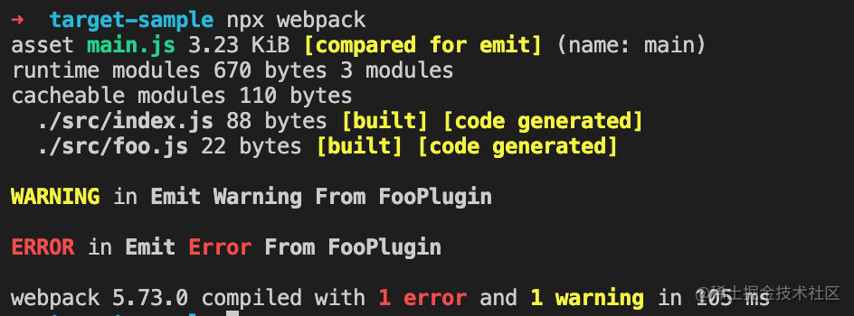
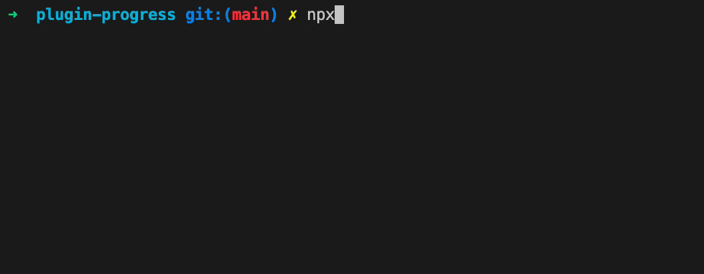

在上一章节中，我们详细介绍了 Webpack 插件的开发方式与基本架构逻辑，并结合若干开源项目剖析插件中如何与 Webpack 上下文交互，从而修改构建逻辑，实现插件功能需求。本文将继续介绍 Webpack 插件开发方法，总结一些较为常用，有助于提升插件可用性、健壮性的开发技巧，包括：

- 如何正确处理插件日志；
- 如何上报统计信息，帮助用户更好了解插件的运行情况；
- 如何借助 `schema-utils` 校验配置参数；
- 如何搭建自动测试环境。

## 日志处理

与 Loader 相似，开发插件时我们也可以复用 Webpack 一系列日志基础设施，包括：

- 通过 `compilation.getLogger` 获取分级日志管理器；
- 使用 `compilation.errors/wraning` 处理异常信息。

下面我们逐一展开介绍。

> 使用分级日志基础设施

在前面 《[Loader 开发基础](https://juejin.cn/book/7115598540721618944/section/7119035404715556879)》一文中，我们已经详细介绍了 Webpack 内置的日志接口： [infrastructureLogging](https://webpack.js.org/configuration/other-options/#infrastructurelogging)，与 [log4js](https://github.com/log4js-node/log4js-node)、[winston](https://github.com/winstonjs/winston) 等日志工具类似，借助这一能力我们能实现日志分级筛选能力，适用于处理一些执行过程的日志信息。

开发插件时，我们也能使用这一接口管理日志输出，只是用法稍有不同，如：

```js
const PLUGIN_NAME = 'FooPlugin'

class FooPlugin {
  apply(compiler) {
    compiler.hooks.compilation.tap(PLUGIN_NAME, (compilation) => {
      // 获取日志对象
      const logger = compilation.getLogger(PLUGIN_NAME)
      // 调用分级日志接口
      logger.log('Logging from FooPlugin')
      logger.error('Error from FooPlugin')
    })
  }
}

module.exports = FooPlugin
```

> 提示：此外，还可以通过 `compiler.getInfrastructureLogger` 获取日志对象。

上述代码需要调用 `compilation.getLogger` 获取日志对象 `logger`，`logger` 的用法与 Loader 场景相似，同样支持 `verbose/log/info/warn/error` 五种日志分级，此处不再赘述。

> 正确处理异常信息

在 Webpack 插件中，可以通过如下方式提交错误信息。

- 使用 `logger.error/warning` 接口，这种方法同样不会中断构建流程，且能够复用 Webpack 的分级日志体系，由最终用户决定是否输出对应等级日志。
- 借助 `compilation.errors/warnings` 数组，如：

```js
const PLUGIN_NAME = 'FooPlugin'

class FooPlugin {
  apply(compiler) {
    compiler.hooks.compilation.tap(PLUGIN_NAME, (compilation) => {
      compilation.errors.push(new Error('Emit Error From FooPlugin'))
      compilation.warnings.push('Emit Warning From FooPlugin')
    })
  }
}

module.exports = FooPlugin
```

执行效果：



这种方法仅记录异常日志，不影响构建流程，构建正常结束后 Webpack 还会将错误信息汇总到 [stats](https://webpack.js.org/api/stats/) 统计对象，方便后续二次处理，使用率极高。例如 [eslint-webpack-plugin](https://github1s.com/webpack-contrib/eslint-webpack-plugin) 就是通过这种方式输出 ESLint 检查出来的代码风格问题。

- 使用 Hook Callback，这种方式可将错误信息传递到 Hook 下一个流程，由 Hook 触发者根据错误内容决定后续处理措施\(中断、忽略、记录日志等\)，如 `imagemin-webpack-plugin` 中：

```js
export default class ImageminPlugin {
  apply(compiler) {
    const onEmit = async (compilation, callback) => {
      try {
        await Promise.all([
          ...this.optimizeWebpackImages(throttle, compilation),
          ...this.optimizeExternalImages(throttle),
        ])

        callback()
      } catch (err) {
        // if at any point we hit a snag, pass the error on to webpack
        callback(err)
      }
    }
    compiler.hooks.emit.tapAsync(this.constructor.name, onEmit)
  }
}
```

上例第 13 行，在 `catch` 块中通过 `callback` 函数传递错误信息。不过，并不是所有 Hook 都会传递 `callback` 函数，实际开发时建议参考相关用例。

- 直接抛出异常，如：

```js
const PLUGIN_NAME = 'FooPlugin'

class FooPlugin {
  apply(compiler) {
    compiler.hooks.compilation.tap(PLUGIN_NAME, (compilation) => {
      throw new Error('Throw Error Directly')
    })
  }
}

module.exports = FooPlugin
```

这种方式会导致 Webpack 进程奔溃，多用于插件遇到严重错误，不得不提前中断构建工作的场景。

总的来说，这些方式各自有适用场景，我个人会按如下规则择优选用：

- 多数情况下使用 `compilation.errors/warnings`，柔和地抛出错误信息；
- 特殊场景，需要提前结束构建时，则直接抛出异常；
- 拿捏不准的时候，使用 `callback` 透传错误信息，交由上游调用者自行判断处理措施。

## 上报统计信息

有时候我们需要在插件中执行一些特别耗时的操作，例如：抽取 CSS 代码（如 [mini-css-extract-plugin](https://github.com/webpack-contrib/mini-css-extract-plugin)）、压缩图片（如 [image-minimizer-webpack-plugin](https://github.com/webpack-contrib/image-minimizer-webpack-plugin)）、代码混淆（如 [terser-webpack-plugin](https://github.com/webpack-contrib/terser-webpack-plugin)），这些操作会延长 Webpack 构建的整体耗时，更糟糕的是会阻塞构建主流程，最终用户会感觉到明显卡顿。

针对这种情况，我们可以在插件中上报一些统计信息，帮助用户理解插件的运行进度与性能情况，有两种上报方式：

- 使用 [ProgressPlugin](https://webpack.js.org/plugins/progress-plugin) 插件的 `reportProgress` 接口上报执行进度；
- 使用 [stats](https://webpack.js.org/api/stats/) 接口汇总插件运行的统计数据。

> 使用 `reportProgress` 接口

[ProgressPlugin](https://webpack.js.org/plugins/progress-plugin) 是 Webpack 内置用于展示构建进度的插件，有两种用法：

1.  简化版，执行构建命令时带上 `--progress` 参数，如：

```
npx webpack --progress
```

2.  也可以在 Webpack 配置文件中添加插件实例，如：

```js
const { ProgressPlugin } = require('webpack')

module.exports = {
  //...
  plugins: [
    new ProgressPlugin({
      activeModules: false,
      entries: true,
      handler(percentage, message, ...args) {
        // custom logic
      },
      //...
    }),
  ],
}
```

开发插件时，我们可以使用 `ProgressPlugin` 插件的 `Reporter` 方法提交自定义插件的运行进度，例如：

```js
const { ProgressPlugin } = require('webpack')
const PLUGIN_NAME = 'BlockPlugin'
const wait = (misec) => new Promise((r) => setTimeout(r, misec))
const noop = () => ({})

class BlockPlugin {
  apply(compiler) {
    compiler.hooks.compilation.tap(PLUGIN_NAME, (compilation) => {
      compilation.hooks.processAssets.tapAsync(PLUGIN_NAME, async (assets, callback) => {
        const reportProgress = ProgressPlugin.getReporter(compiler) || noop
        const len = 100
        for (let i = 0; i < len; i++) {
          await wait(50)
          reportProgress(i / 100, `Our plugin is working ${i}%`)
        }
        reportProgress(1, 'Done work!')
        await wait(1000)
        callback()
      })
    })
  }
}

module.exports = BlockPlugin
```

> 提示：示例代码已上传到小册 [仓库](https://github.com/Tecvan-fe/webpack-book-samples/blob/main/plugin-progress/package.json)。

示例中，最关键的代码在于第 12 行，即调用 `ProgressPlugin.getReporter` 方法获取 Reporter 函数，之后再用这个函数提交执行进度：

```js
const reportProgress = ProgressPlugin.getReporter(compiler) || noop
```

> 注意：若最终用户没有使用 `ProgressPlugin` 插件，则这个函数会返回 Undefined，所以需要增加 `|| noop` 兜底。

`reportProgress` 接受如下参数：

```js
reportProgress(percentage, ...args)
```

- `percentage`：当前执行进度百分比，但这个参数实际并不生效， `ProgressPlugin` 底层会根据当前处于那个 Hook 计算一个固定的 Progress 百分比值，在自定义插件中无法改变，所以目前来看这个参数值随便填就好；
- `...args`：任意数量字符串参数，这些字符串会被拼接到 Progress 输出的信息。

最终执行效果：



> 通过 `stats` 添加统计信息

[stats](https://webpack.js.org/api/stats/) 是 Webpack 内置的数据统计机制，专门用于收集模块构建耗时、模块依赖关系、产物组成等过程信息，我们可以借此分析、优化应用构建性能（后面章节会展开细讲）。在开发插件时，我们可以借用 `stats` 机制，向用户输出插件各种维度的统计信息，例如：

```
const PLUGIN_NAME = "FooPlugin";

class FooPlugin {
  apply(compiler) {
    compiler.hooks.compilation.tap(PLUGIN_NAME, (compilation) => {
      const statsMap = new Map();
      // buildModule 钩子将在开始处理模块时触发
      compilation.hooks.buildModule.tap(PLUGIN_NAME, (module) => {
        const ident = module.identifier();
        const startTime = Date.now();
        // 模拟复杂耗时操作
        // ...
        // ...
        const endTime = Date.now();
        // 记录处理耗时
        statsMap.set(ident, endTime - startTime);
      });

      compilation.hooks.statsFactory.tap(PLUGIN_NAME, (factory) => {
        factory.hooks.result
          .for("module")
          .tap(PLUGIN_NAME, (module, context) => {
            const { identifier } = module;
            const duration = statsMap.get(identifier);
            // 添加统计信息
            module.fooDuration = duration || 0;
          });
      });
    });
  }
}

module.exports = FooPlugin;
```

再次执行 Webpack 构建命令，将产出如下 `stats` 统计信息：

```json
{
  "hash": "0a17278b49620a86b126",
  "version": "5.73.0",
  // ...
  "modules": [
    {
      "type": "module",
      "identifier": "/Users/tecvan/studio/webpack-book-samples/target-sample/src/index.js",
      "fooDuration": 124
      /*...*/
    }
    /*...*/
    /*...*/
    /*...*/
  ],
  "assets": [
    /*...*/
  ],
  "chunks": [
    /*...*/
  ],
  "entrypoints": {
    /*...*/
  },
  "namedChunkGroups": {
    /*...*/
  },
  "errors": [
    /*...*/
  ]
}
```

这种方式有许多优点：

- 用户可以直接通过 `stats` 了解插件的运行情况，不需要重复学习其它方式；
- 支持按需执行，用户可通过 [stats](https://webpack.js.org/configuration/stats/) 配置项控制；
- 支持导出为 JSON 或其它文件格式，方便后续接入自动化分析流程。

因此，若明确插件将执行非常重的计算任务，需要消耗比较长的构建时间时，可以通过这种方式上报关键性能数据，帮助用户做好性能分析。

## 校验配置参数

在《[Loader 开发进阶](https://juejin.cn/book/7115598540721618944/section/7119035564862472233)》一文中，我们已经详细介绍了 [schema-utils](https://www.npmjs.com/package/schema-utils) 校验工具的使用方法，开发插件时也使用这一工具校验配置参数，例如：

```js
const { validate } = require('schema-utils')
const schema = {
  /*...*/
}

class FooPlugin {
  constructor(options) {
    validate(schema, options)
  }
}
```

详细用法可自行回顾《[Loader 开发进阶](https://juejin.cn/book/7115598540721618944/section/7119035564862472233)》章节，此处不再赘述。

## 搭建自动测试环境

为 Webpack Loader 编写单元测试收益非常高，一方面对开发者来说，不用重复搭建测试环境、编写测试 demo；一方面对于最终用户来说，带有一定测试覆盖率的项目通常意味着更高、更稳定的质量。插件测试用例开发有两个关键技术点：

1.  如何搭建自动运行 Webpack，并能够读取构建结果的测试环境？
2.  如何分析构建结果，确定插件逻辑符合预期？

> **搭建测试环境**

Webpack 虽然功能非常复杂，但本质上还是一个 Node 程序，所以我们可以使用一些 Node 测试工具搭建自动测试环境，例如 Jest、Karma 等。以 Jest 为例：

1.  安装依赖，考虑到我们即将用 ES6 编写测试用例，这里额外添加了 [babel-jest](https://jestjs.io/docs/getting-started#using-babel) 等包：

```
yarn add -D jest babel-jest @babel/core @babel/preset-env
```

2.  添加 Babel 配置，如：

```js
// babel.config.js
module.exports = {
  presets: [['@babel/preset-env', { targets: { node: 'current' } }]],
}
```

3.  添加 Jest 配置文件，如：

```js
// jest.config.js
module.exports = {
  testEnvironment: 'node',
}
```

到这里，基础环境设置完毕，我们可以开始编写测试用例了。首先需要在测试代码中运行 Webpack，方法很简单，如：

```js
import webpack from 'webpack'

webpack(config).run()
```

这部分逻辑比较通用，许多开源仓库都会将其提取为工具函数，类似于：

```js
import path from 'path'
import webpack from 'webpack'
import { merge } from 'webpack-merge'
import { createFsFromVolume, Volume } from 'memfs'

export function runCompile(options) {
  const opt = merge(
    {
      mode: 'development',
      devtool: false,
      // Mock 项目入口文件
      entry: path.join(__dirname, './enter.js'),
      output: { path: path.resolve(__dirname, '../dist') },
    },
    options,
  )

  const compiler = webpack(opt)
  // 使用内存文件系统，节省磁盘 IO 开支
  compiler.outputFileSystem = createFsFromVolume(new Volume())

  return new Promise((resolve, reject) => {
    compiler.run((error, stats) => {
      if (error) {
        return reject(error)
      }
      return resolve({ stats, compiler })
    })
  })
}
```

> 提示：示例代码已上传到小册 [仓库](https://github.com/Tecvan-fe/webpack-book-samples/blob/main/plugin-testing/test/helpers/index.js)。

有了测试所需的基础环境，以及运行 Webpack 实例的能力之后，我们可以正式开始编写测试用例了。

> **编写测试用例**

Webpack 插件测试的基本逻辑是：在测试框架中运行 Webpack，之后对比分析构建结果、状态等是否符合预期，对比的内容通常有：

- 分析 `compilation.error/warn` 数组是否包含或不包含特定错误、异常信息，通常用于判断 Webpack 是否运行成功；
- 分析构建产物，判断是否符合预期，例如：
  - `image-minimizer-webpack-plugin` 单测中会 [判断](https://github.com/webpack-contrib/image-minimizer-webpack-plugin/blob/master/test/ImageminPlugin.test.js) 最终产物图片有没有经过压缩；
  - `copy-webpack-plugn` 单测中会 [判断](https://github1s.com/webpack-contrib/copy-webpack-plugin/blob/HEAD/test/CopyPlugin.test.js) 文件有没有被复制到产物文件；
  - `mini-css-extract-plugin` 单测中会 [判断](https://github1s.com/webpack-contrib/mini-css-extract-plugin/blob/HEAD/test/TestCases.test.js) CSS 文件有没有被正确抽取出来。

沿着这个思路，我们构造一个简单的测试用例：

```js
import path from 'path'
import { promisify } from 'util'
import { runCompile } from './helpers'
import FooPlugin from '../src/FooPlugin'

describe('foo plugin', () => {
  it('should inject foo banner', async () => {
    const {
      stats: { compilation },
      compiler,
    } = await runCompile({
      plugins: [new FooPlugin()],
    })
    const { warnings, errors, assets } = compilation

    // 判断 warnings、errors 是否报出异常信息
    expect(warnings).toHaveLength(0)
    expect(errors).toHaveLength(0)

    const { path: outputPath } = compilation.options.output
    // 遍历 assets，判断经过插件处理后，产物内容是否符合预期
    await Promise.all(
      Object.keys(assets).map(async (name) => {
        const pathToEmitted = path.join(outputPath, name)
        const result = await promisify(compiler.outputFileSystem.readFile)(pathToEmitted, {
          encoding: 'UTF-8',
        })
        expect(result.startsWith('// Inject By 范文杰')).toBeTruthy()
      }),
    )
  })
})
```

> 提示：示例代码已上传到小册 [仓库](https://github.com/Tecvan-fe/webpack-book-samples/blob/main/plugin-testing/test/helpers/index.js)。

示例中，17、18 行通过 `errors/warnings` 判断运行过程是否出现异常；25 行读入产物文件，之后判断内容是否满足要求。

## 总结

本文主要介绍 Webpack 插件可用性与健壮性层面的开发技巧，包括：

- 我们应该尽量复用 Webpack Infrastructure Logging 接口记录插件运行日志；
- 若插件运行耗时较大，应该通过 `reportProgress` 接口上报执行进度，供用户了解运行状态；
- 应该尽可能使用 `schema-utils` 工具校验插件参数，确保输入参数的合法性；
- 可以借助 Node 测试工具，如 Jest、Karma 等搭建插件自动测试环境，之后在测试框架中运行 Webpack，分析比对构建结果、状态\(产物文件、`warning/errors` 数组等\)，确定插件是否正常运行。

这些技巧与插件主功能无关，但有助于提升插件质量，还可以让用户更了解插件的运行状态、运行性能等，让插件本身更可靠，更容易被用户选择。

## 思考题

综合全文，思考一下 Logger 的 `warn/error` 接口与 `compilation` 对象的 `errors/warnings` 数组有什么区别？分别适用于什么场景？哪种方式更利于自动化测试？
